Taking the ["System Analysis" course](https://education.borshev.com/system-analysis).

- [Week 1: event storming and data modeling](#week-1-event-storming-and-data-modeling)
  * [Event Storming modeling, looking for contexts](#event-storming-modeling-looking-for-contexts)
  * [Data model and communications](#data-model-and-communications)
  * [Project implementation](#project-implementation)
    + [Components](#components)
    + [Communications](#communications)
    + [Data storage](#data-storage)
  * [Controversial/critical points](#controversialcritical-points)
- [Week 2: strategic DDD](#week-2-strategic-ddd)
  * [Domain and subdomains](#domain-and-subdomains)
    + [Core subdomains](#core-subdomains)
    + [Supporting subdomains](#supporting-subdomains)
    + [Generic subdomains](#generic-subdomains)
  * [Bounded-contexts](#bounded-contexts)
  * [Updating Event Storming and Data Model by DDD findings](#updating-event-storming-and-data-model-by-ddd-findings)
  * [Characteristics and architecture style](#characteristics-and-architecture-style)
  * [Result: architecture](#result-architecture)
- [Week 3: stakeholders, characteristics, conditions and limitations](#week-3-stakeholders-characteristics-conditions-and-limitations)
  * [Stakeholders research](#stakeholders-research)
  * [Choosing architecture style (context analysis)](#choosing-architecture-style-context-analysis)
  * [Found limitations and conditions](#found-limitations-and-conditions)
  * [Characteristics from the previous iteration (week 2)](#characteristics-from-the-previous-iteration-week-2)
  * [Characteristics found in the current iteration](#characteristics-found-in-the-current-iteration)
  * [Characteristics - result](#characteristics---result)
  * [Decomposition to services (subsystems)](#decomposition-to-services-subsystems)
  * [Choosing an architecture style and DB type for each service (subsystem)](#choosing-an-architecture-style-and-db-type-for-each-service-subsystem)
  * [Choosing appropriate communication style and type](#choosing-appropriate-communication-style-and-type)
  * [Verification and fitness-functions](#verification-and-fitness-functions)
  * [Sample ADR](#sample-adr)
    + [ADR-00X: Isolation of “worker hiring” context to the standalone service](#adr-00x-isolation-of-worker-hiring-context-to-the-standalone-service)
- [Week 4: architecture rework planning](#week-4-architecture-rework-planning)
  * [Step 1](#step-1)
  * [Step 2](#step-2)
  * [Step 3](#step-3)
  * [Step 4.1 adding new service “management betting”](#step-41-adding-new-service-management-betting)
  * [Step 4.2 adding a new service with the two contexts "service execution" and "service preparation"](#step-42-adding-a-new-service-with-the-two-contexts-service-execution-and-service-preparation)
  * [Step 4.3 adding two new service for money-related processes instead of a single "accounting and billing"](#step-43-adding-two-new-service-for-money-related-processes-instead-of-a-single-accounting-and-billing)
  * [Result](#result)

# Week 1: event storming and data modeling

## Event Storming modeling, looking for contexts

> Сделайте event storming модель проекта.

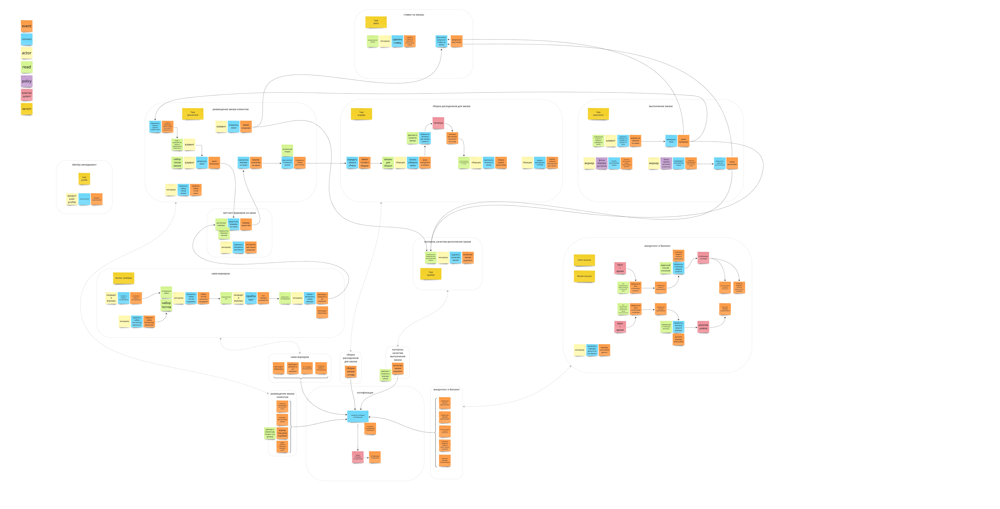

> Текстом опишите логику по которой сгруппировали команды и события в контексты.

Выделил три основных контекста, которые представляют из себя три последовательных этапа одного большого основного процесса:

1. “Размещение заказа клиентом”
2. “Сборка расходников для заказа”
3. “Выполнение заказа”

Отдельно стоит контекст “Найм воркеров”, потому что он представляет из себя самостоятельный процесс, которые поставляет нам новых воркеров в основной процесс.

Отдельно стоит контекст “Аккаунтинг и биллинг”. Несмотря на то, что платится за услуги по смыслу “в конце” основного процесса, кажется логичным выделить аккаунтинг и биллинг в отдельный контекст из-за цикличности и повторяемости процессов внутри него, а так же из-за повышенной сложности процессов.

Отдельно стоит контекст “Контроль качества”. Несмотря на то, что процесс внутри этого контекста выглядит на данный момент скудно, в будущем может разрастись. Процесс внутри этого контекста уже выглядит весьма самодостаточно. Вижу его как бы “лисенером” над основным процессом, который впитывает в себя информацию и генерирует инсайты, которые могут привести к тюнингу основного процесса, побочных процессов или новым фичам в системе.

По похожим причинам, что и контекст “Контроль качества” выделил контексты “Ставки” и “Матчинг воркеров”.

Выделил несколько аспектных (технических?) контекстов:

- “identity management” контекст, т.к. данные о всех пользователях (клиенты, воркеры, менеджменты), взаимодейтсвующих с системой нужны практически везде.
- контекст “нотификаций”, т.к. слушает события других контекстов в системе и производит имейл нотификации.

## Data model and communications

> Сделайте модель данных для требуемой системы

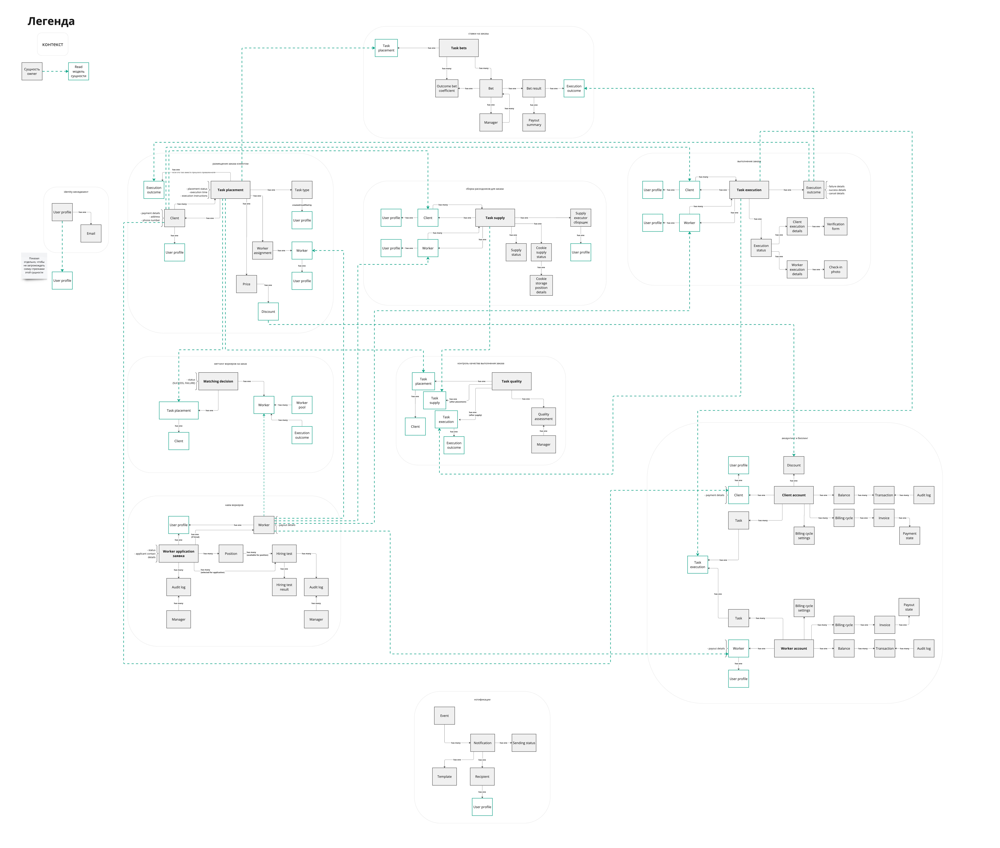

> Сделайте общую модель всех полученных коммуникаций в системе

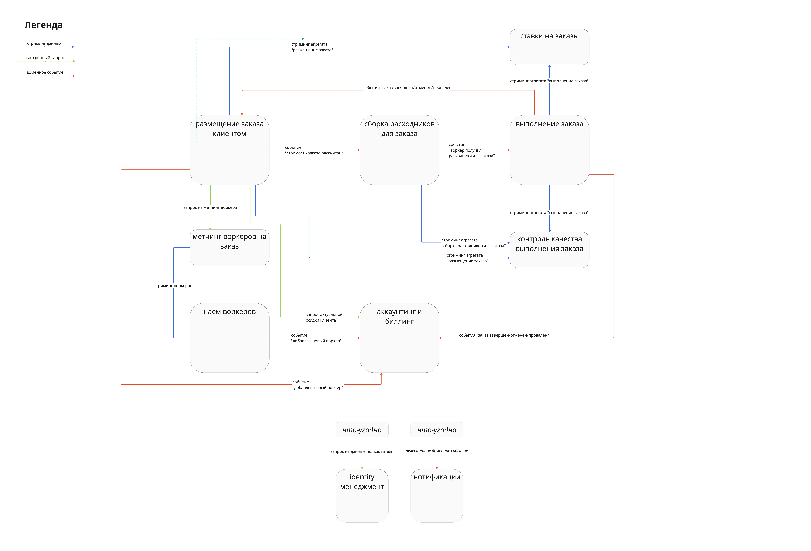

## Project implementation

> Выберете подходящую реализацию проекта (монолит или сервисы, как элементы системы связаны между собой).

### Components

Хочу выдержать баланс между двумя экстремами: монолит или микросервис per контекст.

Прихожу к выводу, что будут следующие компоненты:

- FE + BE для контекста “Размещение заказа клиентом”. BE реализовывает логику и выставляет API для FE, а FE служит для клиентов.
- BE для контекста “Метчинг воркеров”. Выношу отдельно, т.к. для алгоритма рано или поздно понадобится специфичный технологический стек.
- FE + BE для контекста “Найм воркеров”. FE отдельно для того, чтобы спрятать его за какой-нибудь anti-ddos слой.
- FE + BE для контекста “Сборка расходников”. BE реализовывает бизнес-логику и предоставляет API для FE, а FE служит для работников склада.
- FE + BE для контекста “Выполнение заказа”. BE реализовывает бизнес-логику и предоставляет API для FE, а FE служит для воркеров.
- Один общий BE для контекстов “Ставки на заказы” и “Контроль качества”, плюс общий FE для менеджмента. FE включает в себя функциональности ставок и контроля качества, плюс является entry-point’ом в других части системы, где возможны менеджмент-операции. Решил объединить BE для контекстов, с которыми взаимодействует только менеджмент, чтобы снизить Ops нагрузку.
- Отдельный BE для контекста “Аккаунтинг и биллинг”, т.к. в нем много интеграций с платежными системами и более сложная бизнес-логика, потому что завязана на деньгах. Будет предоставлять API, которое будет использоваться на разных FE (менеджментом для начисления денег воркерам, клиентами и воркерами для отображения инвойсов и т.д.)
- Отдельный сервис нотификаций, чтобы удобно было горизонтально скейлить при необходимости.
- Отдельный identity management, но тут требуется более точно проанализировать, для чего конкретно он существует. Есть подозрение, что это какое-то прокси в identity-мир родительской компании happy cat box.

### Communications

Коммуникации между частями системы должны быть понятны из общей диаграммы коммуникаций в системе.

Выбор асинхронно/синхронно старался делать по следующему принципу:

- если в контексте необходимо явно среагировать на какое-то событие, то в этот контекст посылается **доменное событие.** (например, событие “добавлен новый воркер” посылается в “аккаунтинг и биллинг”)
- если в контексте необходимо иметь “под рукой” самые актуальные данные из другого контекста в большом объеме, то в этот контекст данные **стримятся**. (например, новые воркеры стримятся из “наем воркеров” в “метчинг воркеров на заказ”)
- если один контекст требует здесь и сейчас данные другого контекста в небольшом объеме, то этот контекст выполняет **синхронный запрос на получение данных**. (например, “размещение заказа клиентом” запрашивает размер скидки у “аккаунтинг и биллинг” при размещении заказа)

**Синхронные коммуникации** через REST HTTP, чтобы разрабам было проще.

**Репликация** через меседж брокер (Kafka) и самописные события в JSON формате, т.к. объемы данных на старте ожидаются небольшие и чтобы не потребовалась schema-registry.

**Доменные** события через меседж брокер (Kafka) и самописные события в JSON формате, т.к. объемы данных на старте ожидаются небольшие и чтобы не потребовалась schema-registry.

### Data storage

Один физический инстанс PostgreSQL (для снижения ops нагрузки на старте) с разными БД внутри под каждый BE. Если кому-то покажется хорошей идеей хранить данные не в реляционной модели, а в документной (а-ля Mongo), то у PostgreSQL есть хорошая поддержка JSONB. Придерживаюсь подхода **[Choose Boring Technology](https://boringtechnology.club)** на старте.

## Controversial/critical points

- Не очень понял, куда деть отмену задачи, в контекст “Размещение задачи” или контекст “Выполнение задачи”. В “размещение” хочется, потому что там эта команда ближе к клиенту (ведь он ее выполняет), в “выполнение” хочется, потому что так “выполнение” будет единственным местом, где задача будет заканчиваться (успех, провал, отмена), что выглядит как хорошее разделение ответственности.
- Может ли быть контекст без агрегата, как, например, контекст “метчинг воркеров”?
- Решил не реплицировать воркеров из “Наем воркеров” в “Размещение задачи”, чтобы не усложнять. Решил, что необходимые данные о воркере в “Размещение задачи” будут попадать при синхронном метчинге из “Метчинг воркеров”, куда эти данные реплицируются.
- Не совсем уверен, можно ли делать одновременно и стриминг и доменные события по одним и тем же данным в одно и то же место. Кажется, что повышается риск получить данные в неконсистентном состоянии, если событие обгонит стриминг или наоборот.
- Не совсем уверен, хорошо ли передавать данные между контекстами “по цепочке”, например у меня сделано так, что данные из “размещения” попадают в “выполнение” через “сборку”. Опять же, опасаюсь, что если еще дополнительно будем стримить напрямую из “размещения” в “выполнение”, то повышается риск получить неконсистентные данные.
- Не уверен, что делать с менеджментом. Если во всей системе менеджмент покрывает ответственности найма воркеров, управление контентом (справочник типов заказов, набор тестов и т.д.), управление балансом воркера (начисление ему денег “просто так”), контроль качества, а самих воркеров немного, то было бы круто дать воркерам один удобный и быстрый интерфейс, где они смогли бы все это делать. Т.е. больше звучит как аспектная функциональность (как и нотификации). Пока что принимаю решение так и сделать - один менеджмент FE, который общается с разными сервисами, представляющими контексты.

# Week 2: strategic DDD

## Domain and subdomains

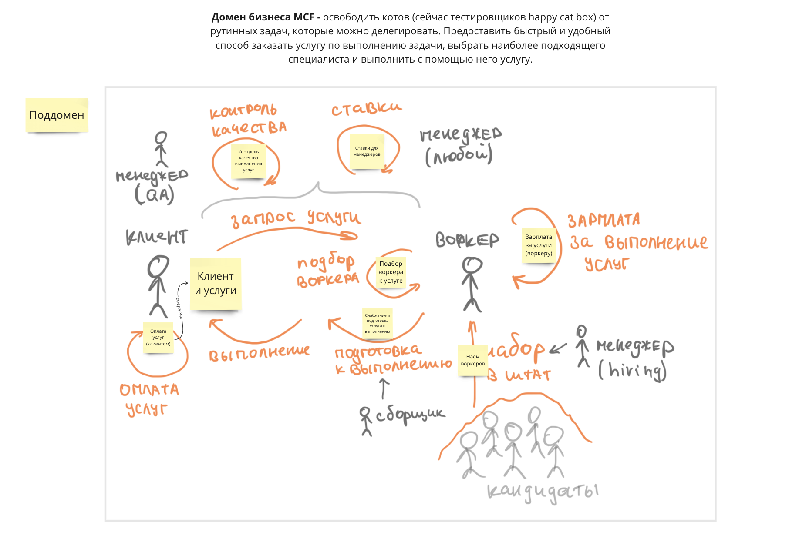

**Домен бизнеса MCF -** освободить котов (сейчас тестировщиков happy cat box) от рутинных задач, которые можно
делегировать. Предоставить быстрый и удобный способ заказать услугу по выполнению задачи, выбрать наиболее подходящего
специалиста и выполнить с помощью него услугу.

Обнаружил следующие поддомены:

- клиент и обеспечение услуги
- подбор воркера к услуге
- снабжение услуги
- выплата зарплат
- наем воркеров
- контроль качества
- ставки для менеджеров

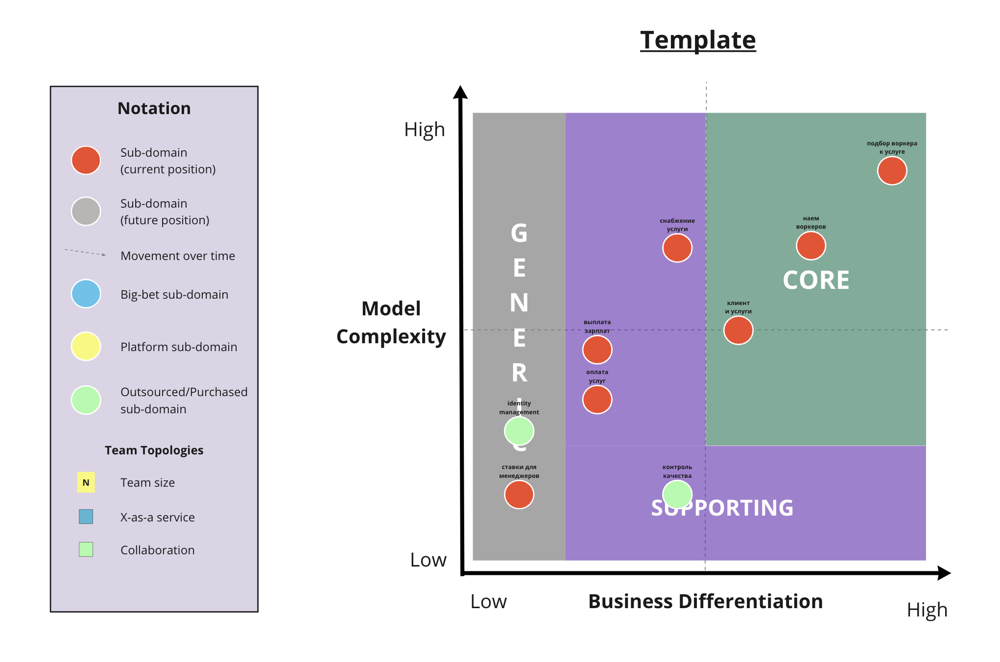

### Core subdomains

Обнаружил три Core поддомена:

- “клиент и обеспечение услуги”
- “подбор воркера к услуге”
- “наем воркеров”.

У всех них высокий показатель business diff, т.к. это ключевые проблемы, которые решает наш бизнес - нанять подходящих
воркеров, принять услугу от клиента и найти для услуги лучшего воркера. У всех них не низкий model compl, т.к.
характеристики воркеров и клиентов это весьма специфичные показатели. Поэтому эти три поддомена попадают в Core.

#### **“подбор воркера к услуге”**

Максимальная business diff и model compl, т.к. содержит “уникальную систему метчинга [US-060]”.

#### **“наем воркеров”**

Model compl выше, чем у “клиент и обеспечение услуги”, потому что проблема поддомена весьма сложная - подобрать воркера,
который “входит в 3% лучших котов мира. [US-080]”. business diff тоже выше, чем у “клиент и обеспечение услуги”, т.к. на
старте фокус бизнеса будет смещен к поиску и корректной оценке самых (топ 3%) элитных воркеров *(это предположение
необходимо верифицировать с бизнесом)*.

#### **“клиент и** обеспечение **услуги”**

Минимальная model compl и business diff среди Core поддоменов. Коты-тестировщики happy cat box очень уставшие и вначале
им требуется хоть какое-нибудь решение их проблем, главное чтобы качественно и в срок. Поэтому качество процессов,
связанных с клиентом (регистрация, создание услуги, выполнение услуги с точки зрения информационной систем и т.д.) не
так приоритетно, как подбор лучшего воркера к требуемой услуге. К тому же, характеристики клиента и его услуги куда
более просты по сравнению с характеристиками воркеров *(эти предположения необходимо верифицировать с бизнесом).*

> В какой-то момент возникла мысль поместить “клиент и обеспечение услуги” в supporting, т.к. в нем не было видно
> “уникальности” для бизнеса - поддомен выглядел достаточно простым, т.к. необходимо всего лишь принять запрос на услугу
> от клиента. Однако позже пришла мысль, что успешность подбора воркеров зависит еще и от характеристик услуги, которую
> запрашивает клиент, поэтому оставил этот домен в Core.
>

### Supporting subdomains

Обнаружил 4 Supporting поддомена:

- “снабжение услуги”
- “выплата зарплат”
- “контроль качества”

  Business differentiation у всех доменов приблизительно одинаковый, т.к. это важные поддомены для решения главной
  проблемы бизнеса, однако не уникальные, как в Core.

#### “снабжение услуги”

Самый сложный (высокий model compl) и один из самых уникальных (высокий business diff) среди всех supporting поддоменов,
т.к. формирует процесс выполнения услуги и влияет на качество выполнения услуги и удовлетворенность клиента.

#### “выплата зарплат” и “оплата услуг”

Средне-сложные и самые неуникальные supporting поддомены. “Выплата зарплат” чуть сложнее, потому что там больше условий.
В выплате или получении денег ничего уникального кроме правил расчета для бизнеса нет.

#### “контроль качества”

Самый несложный, но один из самых “уникальных” supporting поддоменов. Контроль качества это внутренний процесс, в
котором достаточно следить за жизненным циклом услуги и данных, которые к ней относятся. “Уникальность” и важность для
бизнеса у него высока, т.к. именно через контроль качества происходит оценка успешности метчинга, что является важным
для бизнеса на старте *(это предположение необходимо верифицировать с бизнесом).*

### Generic subdomains

Обнаружил 1 generic поддомен - “ставки для менеджеров”

Его уникальность и важность (business diff) для бизнеса видится крайне низкой, т.к. это внутренний процесс, направленный
на повышение эффективности менеджеров, которых в компании немного. Его “сложность” (model compl) так же видится низкой,
т.к. это хорошо известный механизм ставок.

## Bounded-contexts

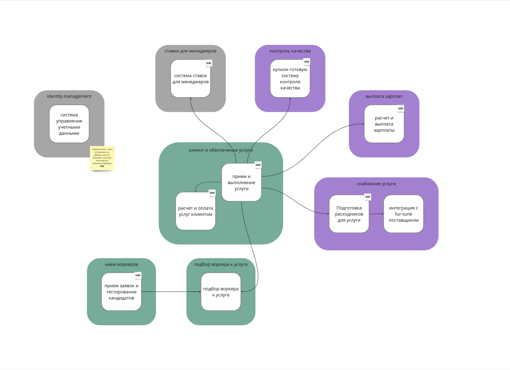

Выделил следующие bounded-контексты

- поддомен “клиент и обеспечение услуги”
    - прием и выполнение услуг
    - расчет и оплата услуг клиентом
- поддомен “наем воркеров”
    - моделирование и подготовка тестов для вакансий и конкретных кандидатов
    - прием заявок и тестирование кандидатов
- поддомен “подбор воркера к услуге”
    - подбор воркера к услуге
- поддомен “снабжение услуги”
    - сборка заказа
    - интеграция с fur-tune поставщиком
- поддомен “выплата зарплат”
    - расчет и выплата зарплаты
- поддомен “контроль качества”
    - *купили готовую систему контроля качества*
- поддомен “ставки для менеджеров”
    - система ставок для менеджеров

### Расхождения с контекстами, найденными по ES

> 🤔 Пока сравнивал с ES, пришел к выводу, что “identity management” и “рассылка нотификаций” очень похожи на
> самостоятельные контексты, но не знаю, к какому поддомену их отнести и правильно ли выделять их в отдельные
> поддомены/контексты. С одной стороны, кажется, что да, т.к. их оценка и размещение на core domain chart и оценка
> характеристик имеют значение, с другой стороны - Ибрагим их не выделил.
> Решил выделить identity management в отдельный домен, т.к. вижу там целый кластер проблем: идентификация
> пользователей (
> всех: воркеров, клиентов, менеджеров), хранение персональных данных, управление правами и т.д.
> Нотификации на отдельный домен не тянут, а вот на отдельный контекст - вполне, но пока их добавлять не буду.

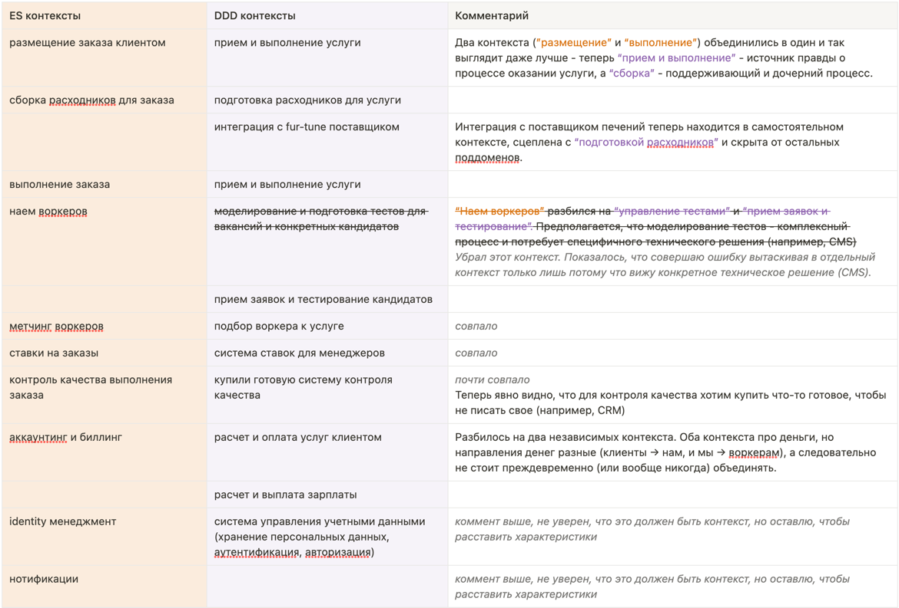

## Updating Event Storming and Data Model by DDD findings

### Как изменились контексты

- Полностью убрал контекст нотификаций.
- Аккаунтинг и биллинг разбился на два новых контекста.
- Выделился контекст интеграции с fur-tune поставщиком.
- Смержился контекст размещение заказа и выполнение заказа.

### Где бизнес-команда разбиралась на технические шаги

- в выплате зарплат воркерам и списании средств у клиентов были лишние шаги “генерирования инвойса”, убрал их. Теперь
  завершился цикл → снимаем / выплачиваем деньги.
- при приеме заказа от клиента вижу, что шаги “назначить воркера на заказ” и “рассчитать стоимость заказа” выглядят
  слишком низкоуровневыми, чтобы быть на ES диаграмме. Однако “рассчитать стоимость заказа” хочу оставить для
  отображения связи с контекстом “подбор воркера к услуге”, а “рассчитать стоимость заказа” хочу оставить для явно связи
  с контекстом “расчет и оплата услуг клиентом”.

### Обновление DM модели по результатам DDD

Изменения в контекстах полностью соответствуют изменениям в ES модели.

Из плюсов отметил, что в общих чертах DM модель стала проще, стало меньше связей между контекстами. Из минусов - домен
“прием и выполнение услуги” выглядит “монструозным” из-за связей с другими контекстами.

## Characteristics and architecture style

| Характеристика  | Важность для проекта                                                                                                                                                                                                                                                                                                                                                                                                                                                                                                                                                                                 |
|-----------------|------------------------------------------------------------------------------------------------------------------------------------------------------------------------------------------------------------------------------------------------------------------------------------------------------------------------------------------------------------------------------------------------------------------------------------------------------------------------------------------------------------------------------------------------------------------------------------------------------|
| Availability    | <b>Не так важно</b>                                                                                                                                                                                                                                                                                                                                                                                                                                                                                                                                                  |
| Scalability     | <b>Не так важно (в общем)</b>   <b>Очень важно (в конкретном поддомене)</b>  Ожидается низкая базовая нагрузка, информации о пиках нагрузки нет. Предполагаю, что раз это дочерняя компания (и множество клиентов ограничено), то скачков нагрузки не будет. НО эта характеристика важна у конкретного контекста “наем воркеров”, т.к. будет паблик и ожидается ddos.   [US-081] Мы ожидаем 1 к заявок в день от рандомных котов, также, судя по отзывам, наши конкуренты могут попытаться нас заддосить в этом месте. |
| Modifiability   | <b>Очень важно</b>   Метрика влияет напрямую на TTM.   ”Бизнесу необходим высокий низкий ТТМ (Time To Market), чтобы конкурировать на рынке.”                                                                                                                                                                                                                                                                                                                                                                                                               |
| Maintainability | <b>Не так важно</b>                                                                                                                                                                                                                                                                                                                                                                                                                                                                                                                                                  |
| Securability    | <b>Средне важно</b>   Система работает с персональными данными (ФИО, адреса, контактные данные) + содержит детали о услугах (может быть чувствительная информация)                                                                                                                                                                                                                                                                                                                                                                                            |
| Performance     | <b>Не так важно</b>   “Общая нагрузка на систему не будет превышать 10 заказов в день и 100 клиентов. Воркеров будет 20 человек.”                                                                                                                                                                                                                                                                                                                                                                                                                                                                  |
| Agility         | <b>Очень важно</b>   В некоторых частях системы у бизнеса есть опасения, поэтому необходимо быстро подстроиться к изменениям, если возникнут. Например:   ”[US-170] Хоть получение каждого печенья поштучно под клиента выглядит странно, мы всё равно решили воспользоваться этой компанией.”   ”[US-290] Это не самый критически важный проект для компании, поэтому он вряд ли будет часто меняться.”                                                                                                                                                                                 |
| Testability     | <b>Очень важно</b>   Как и Modifiability                                                                                                                                                                                                                                                                                                                                                                                                                                                                                                                                                           |
| Deployability   | <b>Очень важно</b>   Как и Modifiability                                                                                                                                                                                                                                                                                                                                                                                                                                                                                                                                                           |
| Usability       | <b>Не так важно</b>   Большая часть пользователей системы - клиенты, которые являются сотрудниками родительской компании, поэтому у них ожидается высокая лояльность и терпимость к системе.                                                                                                                                                                                                                                                                                                                                                                                                       |
| Consistency     | <b>Не так важно</b>   В системе нет критичных процессов, которые бы требовали очень высокую consistency                                                                                                                                                                                                                                                                                                                                                                                                                                                                                            |
| Simplicity      | <b>Не так важно</b>   Как и Usability                                                                                                                                                                                                                                                                                                                                                                                                                                                                                                                                                              |

Выбираем из следующих стилей:

- layered
- modular monolith
- service-based
- microservices

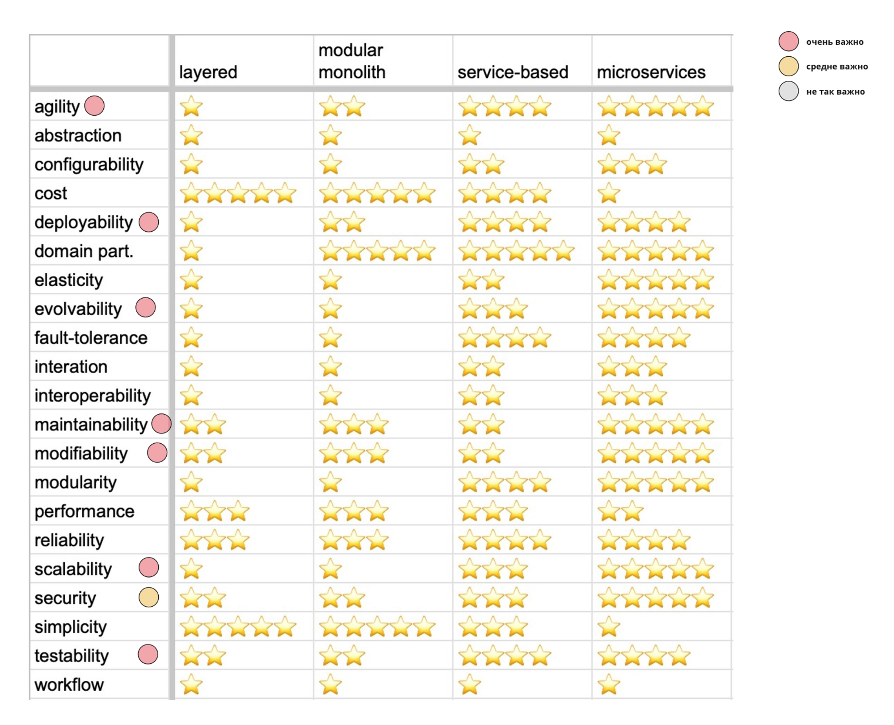

Сравнение архитектурных стилей по характеристикам указывает на то, что лучше всего подходит микросервисный подход.

С микросервисным подходом в данном случае я согласен и хотел бы выбрать его, но это не означает, что нужно сделать
микросервис per баундед-контекст. Т.к. бизнес находится в фазе роста, необходимо найди баланс, чтобы слишком не
перегрузить систему и людей проблемами микросервисного подхода: коммуникации между сервисами, observability, debugging и
т.д.

## Result: architecture

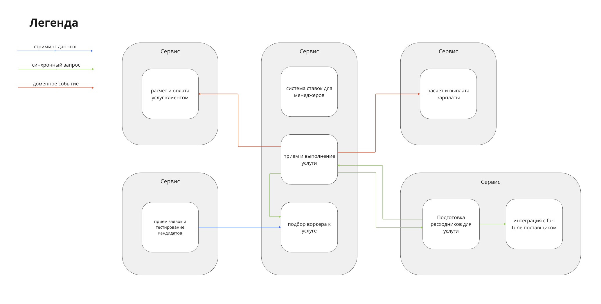

Выделил 5 сервисов:

**по сервису на зарплату и оплату услуг** - Отделил друг от друга, чтобы были независимые и были готовы к расхождению в логике обработки бизнес-событий.

**сервис для приема заявок** - отдельно, т.к. нужно уметь скейлить и выдерживать ddos.

**сервис для подготовки заказа и интеграции с fur-tune поставщиком** - объединил на первое время, чтобы не перегружать систему. Если начнет разрастаться - можно разделить, главное снимать
метрики и следить.

**“главный” сервис с полным жизненным циклом задачи, алгоритмом подбора воркера на задачу и системой ставок** - объединил на первое время, чтобы перегружать систему. Если начнет разрастаться - можно разделить, главное снимать
метрики и следить.

Разработчики алгоритма подбора обещали, что справятся с разработкой алгоритма на любом языке [US-070].

Система ставок не будет часто меняться [US-290] и сложной логики там нет.

Коммуникации:

- старался выбирать синхронные, чтобы было меньше технологического оверхеда. Как только синхронных коммуникаций
  перестанет хватать (напр. в логике метчинга воркера или в передаче заказа на сборку), то можно подумать о асинхронных.
- из “найма воркеров” в “подбор воркеров для задачи” выбрал стриминг, чтобы не блокировать процессы в найме добавление
  нового воркера в алгоритм.
- в сервисы с зарплатой и оплатой услуг выбрал асинхронную коммуникацию с помощью доменных событий, т.к. для расчета
  зарплаты/оплаты услуг важны доменные события, а не только конечные данные.

# Week 3: stakeholders, characteristics, conditions and limitations

## Stakeholders research

> попробуйте расписать стейкхолдеров по группам из урока. Попутно пофантазируете, кого потенциально мы забыли указать в списке стейкхолдеров;
>

От себя добавил таких стейкхолдеров:

- кандидаты в воркеры
- воркеры
- сборщики заказов
- датасайнтисты / разработчики алгоритма метчинга

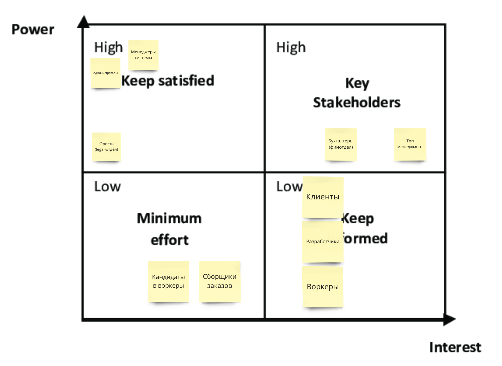

## Choosing architecture style (context analysis)

> выберите один из семи архитектурных стилей, описанных в уроке. Опишите, почему вы сделали такой выбор и по каким критериям сравнивали стили (можно использовать картинку из урока со сравнением стилей);
>
> - если выбрали распределённый архитектурный стиль, опишите, какие сервисы будут отдельно, и объясните, почему каждый из сервисов должен быть отдельно от остальных;

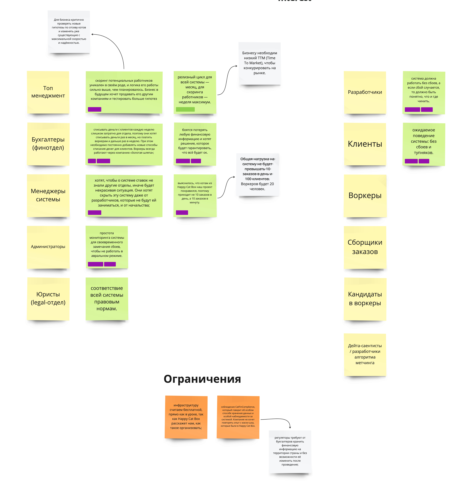

## Found limitations and conditions

### Do not consider infrastructure cost

*“Инфраструктуру считаем бесплатной, прямо как в уроке, так как Happy Cat Box расскажет нам, как такое организовать”* - получили от бизнеса (дано в уроке)

**Вывод:** цену инфраструктуры не учитываем.

### Respect CatFinCompliance

*“Соблюдение CatFinComplience, который говорит об особом способе хранения данных и особой наблюдаемости за системой. Компания не хочет повторять опыт с маски-шоу, которые были в Happy Cat Box.”* - получили от бизнеса (дано в уроке)
Нужно обратить внимание на условия и решение, примененное в Happy Cat Box:

> регуляторы требуют от бухгалтеров хранить финансовую информацию на территории страны и без возможности её изменить после проведения;
>

## Characteristics from the previous iteration (week 2)

- **~~scalability~~** **availability** для контекста “прием заявок и тестирование кандидатов” (из US-081 DDoS)
- **agility, testability** и **deployability** - из-за низкого TTM, для всей системы
- **agility** для поддомена “подбор воркера к услуге”
- **modifiability** и **maintainability** - из high model complexity поддоменов “клиент и управление услугами”, “подбор воркера к услуге” и “расширение штата воркеров”

## Characteristics found in the current iteration

- высокая **scalability**, **maintainability**, **modifiability**, **testability**, **agility** и **evolvability** - для всей системы, т.к. система находится на стадии роста + от стейхолдеров известно, что будет в 10 раз больше заказов.
- высокая **securability** и **consistency** - для контекстов “выплат”, для соблюдения CatFinCompliance. (от юристов)
- высокая **modularity** и **evolvability** - для поддоменов “подбор воркера к услуге” и “расширение штата воркеров”, требование от топ-менеджмента
- **базовый релизный цикл** (для всей системы) - месяц
- **релизный цикл для поддомена “подбор воркера к услуге”** - максимум неделя
- **agility,** **modularity** и **testability** - для контекста “расчет и оплата услуг клиентом”, т.к. будут добавляться новые способы оплаты.
- **изолированный** поддомен “повышения мотивации менеджеров”
- **observability** - для всей системы, требование от администратором
- **availability** - от клиентов, для контекста “прием и выполнение услуги”
- **simplicity** - от разработчиков (посмотрим, нужно ли как-то явно выполнять или нет)

## Characteristics - result

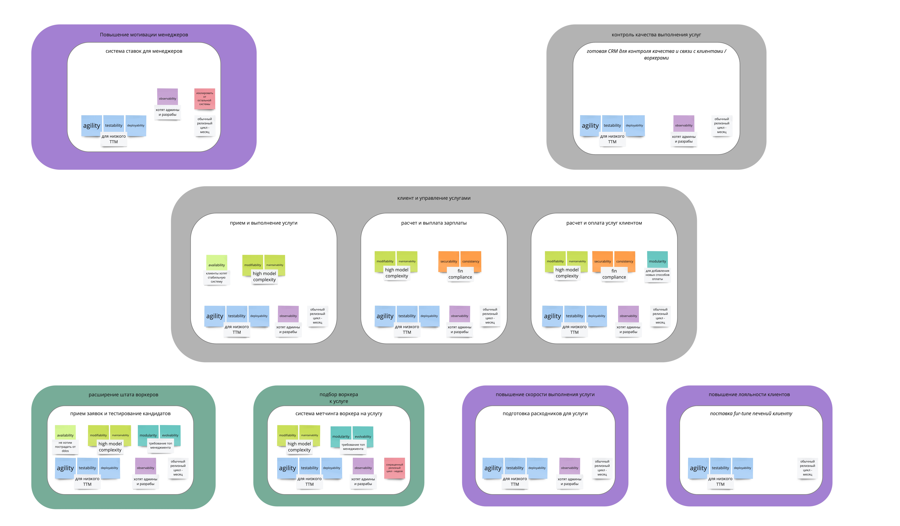

## Decomposition to services (subsystems)

Берем наши контексты и принимаем решения:

1. "*поставка fur-tune печений клиенту” -* внешняя система, поэтому отдельно
2. “*готовая CRM для контроля качества и связи с клиентами / воркерами” -* внешняя система, поэтому отдельно
3. “система ставок для менеджеров” - отдельная подсистема, т.к. по требованиям стейкхолдеров необходимо его “спрятать” от всех остальных частей системы, разрабатывать, деплоить, мониторить отдельно.
4. “прием заявок и тестирование кандидатов” - отдельная подсистема, т.к. ему необходимо обеспечить высокую availability (user-facing + ddos)
5. “система метчинга воркера на услугу” - отдельная подсистема, т.к. ему необходимо обеспечить ускоренный релизный цикл.
6. “расчет и выплата зарплаты” - отдельная подсистема, чтобы выполнять требования каплаенса, безопасности и legal по хранению и обработке данных.
7. “расчет и оплата услуг клиентом” - отдельная подсистема, т.к. будет расширяться методами оплаты (тут не уверен, стоит ли выносить в отдельный, возможно, это лишнее и можно по-началу смержить с “зарплатным” сервисом, т.к. характеристики не конфликтуют)
8. “прием и выполнение услуг” и “подготовка расходинков для услуги” - мержу в одну подсистему, т.к. характеристики не конфликтуют, не хочется делать лишнюю подсистему, чтобы снизить операционную нагрузку на систему.

## Choosing an architecture style and DB type for each service (subsystem)

Итого, после предыдущего шага получилось 6 подсистем, т.е.:

- 5 одноименных подсистем, содержащих один контекст
- 1 подсистема “исполнения услуг”, который содержит контекст “прием и выполнение услуги” и “подготовка расходников для услуги”

**Подсистема** “**исполнения услуг” - modular monolith,** потому что содержит два контекста, которые мы хотим доменно отделить друг от друга (для большего порядка внутри подсистемы, для параллелизации работы над подсистемой, для готовности разделить в разные сервисы если понадобится)

**Подсистема “метчинга воркера на услугу”** **-** **pipeline**, чтобы обеспечить высокую flexibility, modularity и modifiability, которую хочет как бизнес, так и разработчики.

**Подсистема “ставки для менеджеров” - layerd monolith**, выбираем самый простой и привычных стиль, т.к. не содержит сложной логики и критической для бизнеса функциональности.

**Подсистема “прием заявок и тестирование кандидатов” - microkernel**, т.к. должна иметь высокую modifiability, modularity, evolvability для быстрого реагирования на изменения бизнеса (например, в случаях, когда результаты проверки гипотез приведут к новым фичам для этого контекста).

**Подсистемы “расчет и оплата услуг клиентом” и “расчет и выплата зарплаты” - layered monolith**, несмотря на то, что бизнес-логика сложна, выбираем простой и привычный стиль, чтобы не усложнять эти подсистемы (simplicity).

**Документоориентированная база данных** будет использоваться в двух подсистах

- прием заявок и тестирование кандидатов
- система метчинга воркера на услугу

Будет один физический инстанс с логическим разделением на две разные базы данных для снижения операционных расходов в системе.

В этих подсистемах не критичная консистентность, однако критичная flexibility и modifiability данных (для частых изменений в подсистемах)

**Реляционная база данных** будет использоваться в остальных подсистемах.

Для подсистем “выплат зарплат” и “оплаты услуг” географические расположение данных и соблюдение комплаенса, это будет отдельный инстанс базы данных.

Для подсистемы “исполнения услуги” выбираем тот же типа базы данных для технологической консистентности и упрощения одной из самых крупных подсистем.

Для подсистемы “ставок” выбираем тот же типа базы данных по тем же причинам + это будет отдельный инстанс, чтобы “спрятать” его от остальных в компании (требование стейкхолдеров)

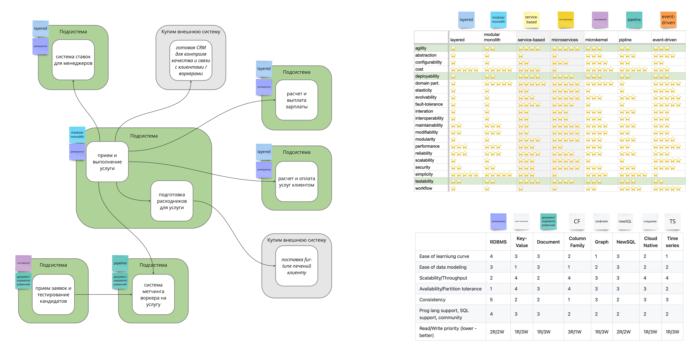

## Choosing appropriate communication style and type

В местах, где задержка в актуализации данных не так критична, однако данные нужно поддерживать в актуальном состоянии выбирал **асинхронную коммуникацию через репликационные события** (напр. стриминг из “исполнения услуг” в “выплаты зарплаты” и “оплату услуг”)

В местах, где не так много логики и достаточно on demand получить небольшое количество данных, выбирал **синхронную коммуникацию**. (напр. расчет скидки, получение воркера к услуге, запрос печенья при сборке)

В местах, где бизнес-логика зависит от событий и в то же время нет необходимости немедленного получения результата выбирал **асинхронную коммуникацию с помощью отправки бизнес-событий**, чтобы не блокировать процесс-emitter событий. (напр. получение доменных событий в сервисах “выплаты зарплат” и “оплаты услуг”, в сервисах “ставок” и “контроля качества”)

При выборе между асинхронной доменной коммуникацией и синхронной преимущество имела синхронная для простоты системы и низкого порога вхождения имплементаторов.

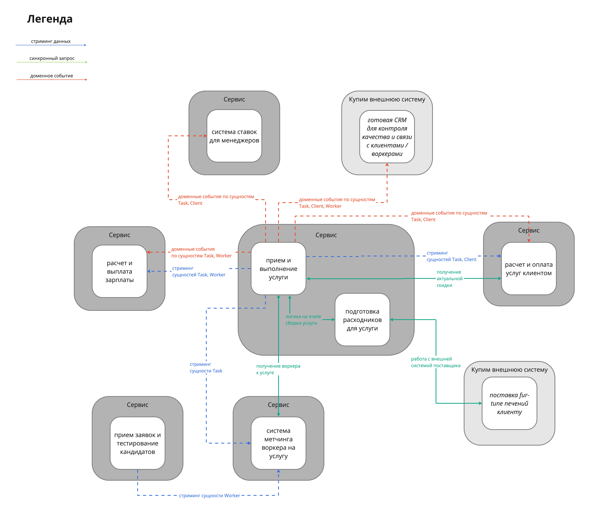

## Verification and fitness-functions

- покрытие тестами
  - core-поддомены 90%
  - остальные поддомены 60%
- проверка соблюдения необходимой периодичности релизов
  - “система метчинга воркера на услугу” - максимум 1 неделья
  - остальные подсистемы - максимум 4 недели
- репорты о выданных доступах в БД
  - критично для подсистем “выплата зарплат” и “оплата услуг”
- ручной контроль соблюдения архитектурных стилей
  - модульный монолит для подсистемы “прием и выполнение услуги”
  - микрокернел для подсистемы “приема заявок и тестирования кандидатов”
  - пайплайн для подсистемы “метчинга воркера на услугу”
  - *в будущем возможна имплементация с помощью ArchUnit, т.к. система будет написана на Java стеке (язык Kotlin), но на старте проекта на это не стоит тратить время*
- ручной контроль доступов к подсистеме “ставок” (код, документация, окружение и т.д.)
- ручное отслеживание достаточно высокого уровня observability всей системы
  - сбор необходимой базовой телеметрии со всех компонент
- автоматический контроль availability с помощью мониторинга значения и алертинга в случае нарушений
  - у подсистемы “прием заявок и тестирование кандидатов” - на старте достаточно 99%
  - у подсистемы “прием и выполнение услуги” - 99.9%
- автоматический контроль scalability с помощью нагрузочных тестов в пайплайне
  - у подсистемы “прием заявок и тестирование кандидатов” - на старте достаточно 99%
  - у подсистемы “прием и выполнение услуги” - 99.9%
- автоматический контроль reliability у поддомена “прием заявок и тестирование кандидатов” с помощью эмуляции ddos атаки на live окружении
- анализ метрик coupling и cohesion вручную методом исследования кода и автогенерируемой документации
  - подсистема “прием заявок и тестирование кандидатов”
  - подсистема “система метчинга воркера на услугу”
  - подсистема “прием и выполнение услуги”

## Sample ADR

### ADR-00X: Isolation of “worker hiring” context to the standalone service

#### ****Status****

*Accepted*

#### ****Context****

Необходимо принять решение, в каком виде будет реализован контекст “прием заявок и тестирование кандидатов” в системе:

- будет самостоятельным сервисом
- будет объединен в один сервис с другим контекстом, имеющим схожие характеристики - “прием и выполнение услуги”

#### ****Decision: To be a standalone service****

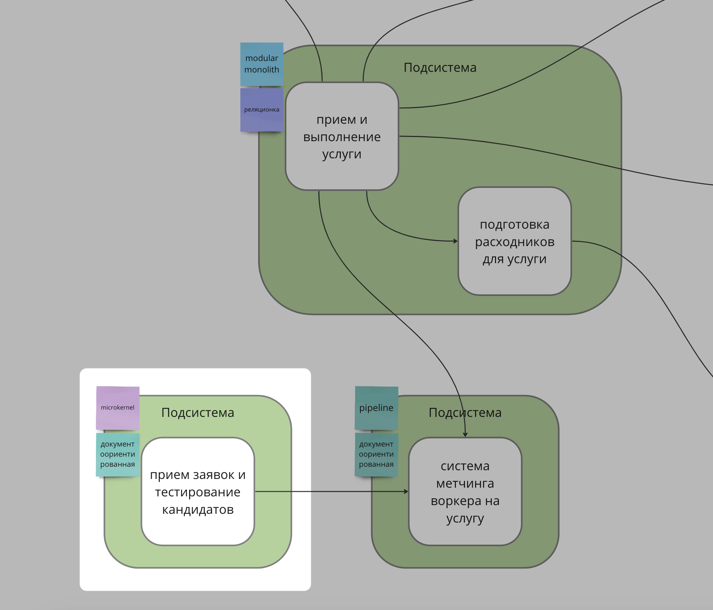

Решено иметь контекст “прием заявок и тестирование кандидатов” изолированно в отдельном сервисе, так как:

- помимо высокой availability у сервиса есть риск быть подвергнутым DDoS атакам, потому что сервис доступен в интернете.

Для обеспечения высокого значения resilience (отказоустойчивости) всей системы и чтобы не перемешивать контексты из разных поддоменов решено не объединять с контекстом “прием и выполнение услуги”, а сделать самостоятельным сервисом.

#### **Consequences**

В результате этого решение вырастает нагрузка на поддержку и обеспечение всей системы, однако это намного меньшее зло, чем подвергнуть риску выводу из строя сразу обе подсистемы / контекста.

#### **Сompliance**

К сожалению, может быть проверено только вручную архитектурным ревью системы.

#### **Alternatives**

- контекст будет объединен в один сервис с другим контекстом, имеющим схожие характеристики - “прием и выполнение услуги”

# Week 4: architecture rework planning

## Step 1

- зарисовал “нулевую” систему в привычной нотации (сервисы + коммуникации)

Система из нулевой домашки

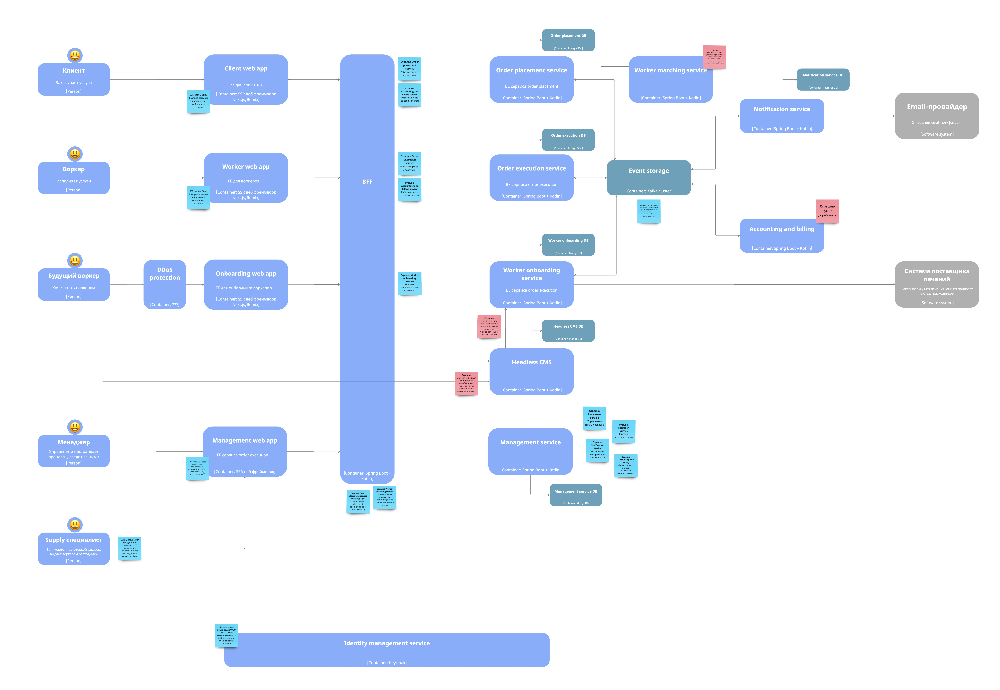

Система из нулевой домашки в привычной нотации
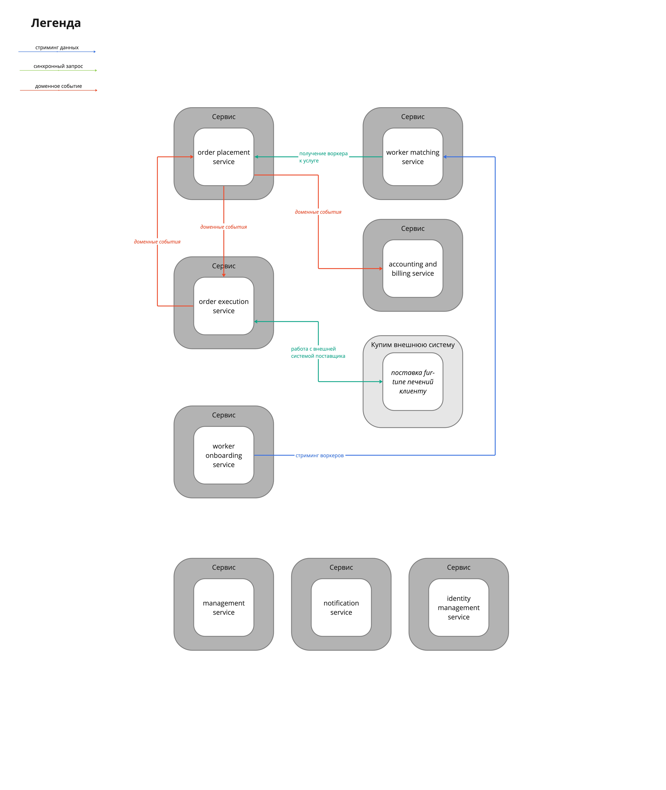

## Step 2

- добавил неочевидные коммуникации в “нулевую систему”
- убрал аспектные / инфрастуктурные сервисы, не учитываем их при анализе
- считаю инстабилити и нахожу отмечаю самые проблемные места

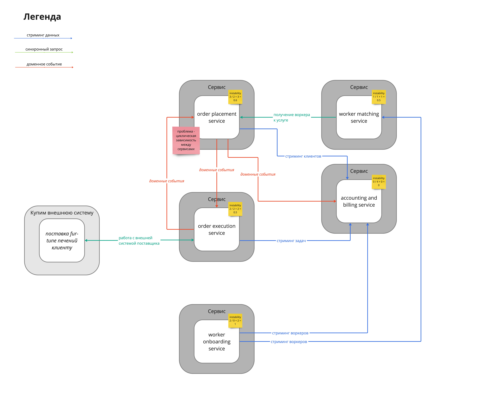

## Step 3

- нахожу, где в моей AS IS находятся контексты TO BE

| TO BE контекст | Поддомен | где находится в AS IS | Статус |
| --- | --- | --- | --- |
| прием и выполнение услуги | generic | order placement и order execution | не совпало |
| подготовка расходников для услуги | supporting | order execution | не совпало |
| система метчинга воркера на услугу | core | worker matching | совпало |
| прием заявок и тестирование кандидатов | core | worker onboarding | совпало |
| расчет и оплата услуг клиентом | generic | accounting and billing | не совпало |
| расчет и выплата зарплаты | generic | accounting and billing | не совпало |
| система ставок для менеджеров | supporting | нет | не совпало |

Анализирую сравнение, получается список того, что необходимо поменять / добавить:

- “order placement” и “order execution” нужно смержить в один сервис (в котором находятся два контекста “прием и выполнение услуги” и “подготовка расходников для услуги”) - **надо менять**
- “система метчинга воркера на услугу” матчится 1 к 1 с “worker matching” - **не надо менять**
- “прием заявок и тестирование кандидатов” матчится 1 к 1 с “worker onboarding” - **не надо менять**
- “accounting and billing” должен распасться на 2 сервиса: “расчет и оплата услуг клиентом” и “расчет и выплата зарплаты” - **надо менять**
- “система ставок для менеджеров” отсутствует - **надо добавить**

Мы находимся в условиях отсутствия опыта (в моих кругах это более частый случай), поэтому тактика будет такой:

- мигрируем систему от простых элементов к сложным
- ~~если приоритеты позволяют, начинаем с отсутствующих элементов~~ в нашем случае распределенная инфрастуктура уже есть и используется в проде, поэтому не актуально
- ~~начать с generic, закончить core~~ в нашем случае core поддомены совпали, поэтому core мигрировать не требуется
- начать с меньших элементов, закончить большими

Составляю список изменений:

- добавление нового сервиса “система ставок для менеджеров”
- добавление нового сервиса с двумя контекстами “прием и выполнение услуги” и “подготовка расходников для услуги” вместо двух существующих сервисов “order placement” и “order execution”
- добавление двух новых сервисов для денег вместо текущего одного “accounting and billing”

## Step 4.1 adding new service “management betting”

Предположим, что приоритеты нам позволяют начать наш проект перехода с добавления нового сервиса.

Имплементируем сервис, подключаем его к нашей инфраструктуре доменных событий по Task и Client сущностям.

Этим слегка повышаем instability “order execution service” сервиса с 0.5 на 0.6, но считаем это допустимым, т.к. это временные эффект.

## Step 4.2 adding a new service with the two contexts "service execution" and "service preparation"

1. добавляем логику сервиса “order placement service” в сервис “order execution service”, а после убираем “order placement service”. получаем вместо двух сервисов с 0.6 и 0.6 instability один на 0.83 instability. Делаем это через CDC.
2. делаем рефакторинг внутри сервиса на модульный монолит, извлекаем логику подготовки расходников в отдельный модель и получаем два контекста: “прием и выполнение услуги” (0.83 instability) и “подготовка расходников для услуги” (0 instability)

## Step 4.3 adding two new service for money-related processes instead of a single "accounting and billing"

1. отказываемся от стриминга воркеров из “worker onboarding service” в “accounting and billing service”, т.к. эта избытычно. воркеры в биллинг должны попадать только из одного места и в таргет решении это будет “прием и выполнение услуги”. “Вспоминаем” про то, что нам нужно считать скидку (про эту фичу просто забыли), добавляем это как синхронную связь (как в таргет решении). Меняем instability с 0 на 0.25.
2. Распиливаем монолитный биллинг на два сервиса, в каждом по контексту “расчет и оплата услуг клиентом” и “расчет и выплата зарплаты” с помощью CDC.
3. После окончании имплементации двух новых сервисов включаем в систему новые, отключаем старые. Оставляем старый сервис функционировать, чтобы вернуться на него в случае роллбека. Верифицируем корректность работы новых сервисов с помощью сравнения данных из старого.

## Result

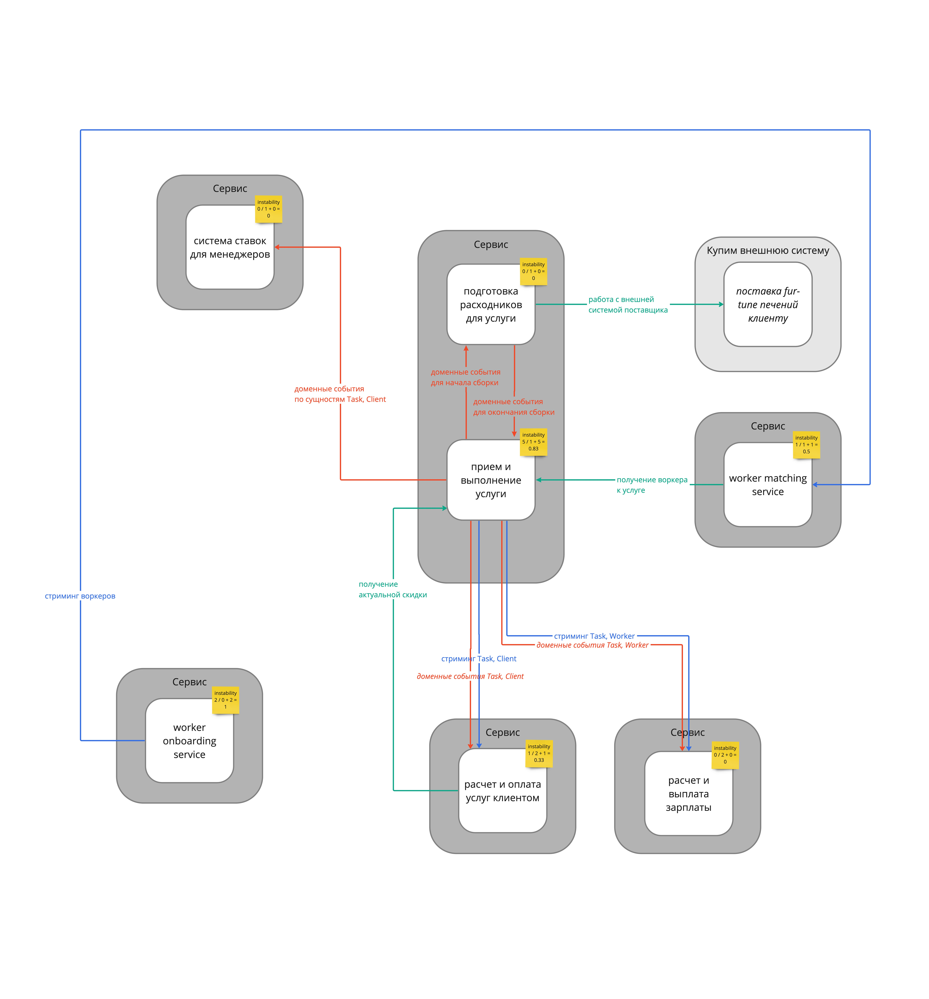
