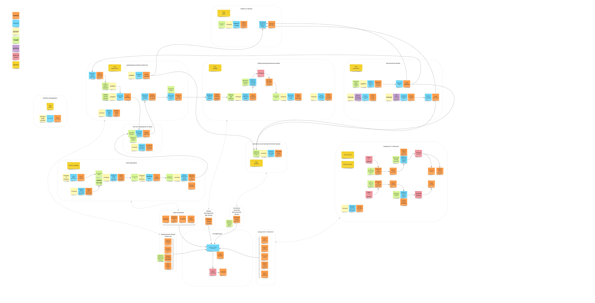
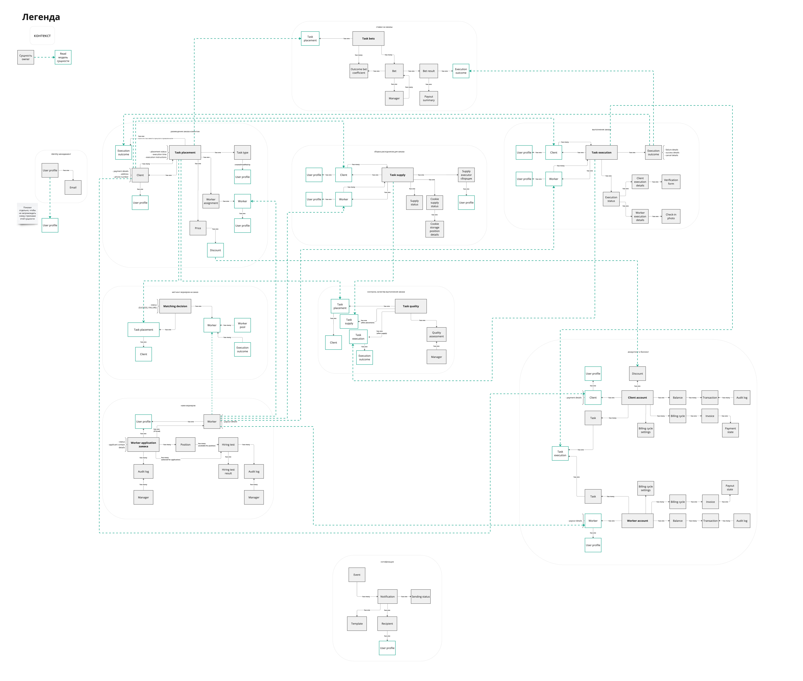
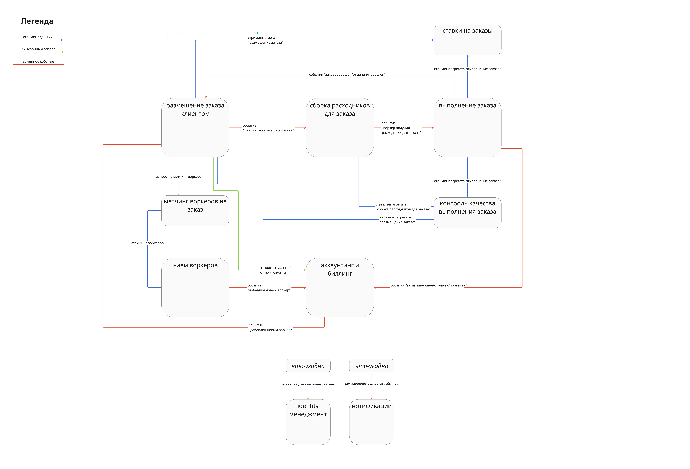

# Week 1: event storming and data modeling

# Event Storming modeling, looking for contexts

> Сделайте event storming модель проекта.

> Текстом опишите логику по которой сгруппировали команды и события в контексты.

Выделил три основных контекста, которые представляют из себя три последовательных этапа одного большого основного процесса:

1. “Размещение заказа клиентом”
2. “Сборка расходников для заказа”
3. “Выполнение заказа”

Отдельно стоит контекст “Найм воркеров”, потому что он представляет из себя самостоятельный процесс, которые поставляет нам новых воркеров в основной процесс.

Отдельно стоит контекст “Аккаунтинг и биллинг”. Несмотря на то, что платится за услуги по смыслу “в конце” основного процесса, кажется логичным выделить аккаунтинг и биллинг в отдельный контекст из-за цикличности и повторяемости процессов внутри него, а так же из-за повышенной сложности процессов.

Отдельно стоит контекст “Контроль качества”. Несмотря на то, что процесс внутри этого контекста выглядит на данный момент скудно, в будущем может разрастись. Процесс внутри этого контекста уже выглядит весьма самодостаточно. Вижу его как бы “лисенером” над основным процессом, который впитывает в себя информацию и генерирует инсайты, которые могут привести к тюнингу основного процесса, побочных процессов или новым фичам в системе.

По похожим причинам, что и контекст “Контроль качества” выделил контексты “Ставки” и “Матчинг воркеров”.

Выделил несколько аспектных (технических?) контекстов:

- “identity management” контекст, т.к. данные о всех пользователях (клиенты, воркеры, менеджменты), взаимодейтсвующих с системой нужны практически везде.
- контекст “нотификаций”, т.к. слушает события других контекстов в системе и производит имейл нотификации.

# Data model and communications

> Сделайте модель данных для требуемой системы

> Сделайте общую модель всех полученных коммуникаций в системе

# Project implementation

> Выберете подходящую реализацию проекта (монолит или сервисы, как элементы системы связаны между собой).

## Components

Хочу выдержать баланс между двумя экстремами: монолит или микросервис per контекст.

Прихожу к выводу, что будут следующие компоненты:

- FE + BE для контекста “Размещение заказа клиентом”. BE реализовывает логику и выставляет API для FE, а FE служит для клиентов.
- BE для контекста “Метчинг воркеров”. Выношу отдельно, т.к. для алгоритма рано или поздно понадобится специфичный технологический стек.
- FE + BE для контекста “Найм воркеров”. FE отдельно для того, чтобы спрятать его за какой-нибудь anti-ddos слой.
- FE + BE для контекста “Сборка расходников”. BE реализовывает бизнес-логику и предоставляет API для FE, а FE служит для работников склада.
- FE + BE для контекста “Выполнение заказа”. BE реализовывает бизнес-логику и предоставляет API для FE, а FE служит для воркеров.
- Один общий BE для контекстов “Ставки на заказы” и “Контроль качества”, плюс общий FE для менеджмента. FE включает в себя функциональности ставок и контроля качества, плюс является entry-point’ом в других части системы, где возможны менеджмент-операции. Решил объединить BE для контекстов, с которыми взаимодействует только менеджмент, чтобы снизить Ops нагрузку.
- Отдельный BE для контекста “Аккаунтинг и биллинг”, т.к. в нем много интеграций с платежными системами и более сложная бизнес-логика, потому что завязана на деньгах. Будет предоставлять API, которое будет использоваться на разных FE (менеджментом для начисления денег воркерам, клиентами и воркерами для отображения инвойсов и т.д.)
- Отдельный сервис нотификаций, чтобы удобно было горизонтально скейлить при необходимости.
- Отдельный identity management, но тут требуется более точно проанализировать, для чего конкретно он существует. Есть подозрение, что это какое-то прокси в identity-мир родительской компании happy cat box.

## Communications

Коммуникации между частями системы должны быть понятны из общей диаграммы коммуникаций в системе.

Выбор асинхронно/синхронно старался делать по следующему принципу:

- если в контексте необходимо явно среагировать на какое-то событие, то в этот контекст посылается **доменное событие.** (например, событие “добавлен новый воркер” посылается в “аккаунтинг и биллинг”)
- если в контексте необходимо иметь “под рукой” самые актуальные данные из другого контекста в большом объеме, то в этот контекст данные **стримятся**. (например, новые воркеры стримятся из “наем воркеров” в “метчинг воркеров на заказ”)
- если один контекст требует здесь и сейчас данные другого контекста в небольшом объеме, то этот контекст выполняет **синхронный запрос на получение данных**. (например, “размещение заказа клиентом” запрашивает размер скидки у “аккаунтинг и биллинг” при размещении заказа)

**Синхронные коммуникации** через REST HTTP, чтобы разрабам было проще.

**Репликация** через меседж брокер (Kafka) и самописные события в JSON формате, т.к. объемы данных на старте ожидаются небольшие и чтобы не потребовалась schema-registry.

**Доменные** события через меседж брокер (Kafka) и самописные события в JSON формате, т.к. объемы данных на старте ожидаются небольшие и чтобы не потребовалась schema-registry.

## Data storage

Один физический инстанс PostgreSQL (для снижения ops нагрузки на старте) с разными БД внутри под каждый BE. Если кому-то покажется хорошей идеей хранить данные не в реляционной модели, а в документной (а-ля Mongo), то у PostgreSQL есть хорошая поддержка JSONB. Придерживаюсь подхода **[Choose Boring Technology](https://boringtechnology.club)** на старте.

# Controversial/critical points

- Не очень понял, куда деть отмену задачи, в контекст “Размещение задачи” или контекст “Выполнение задачи”. В “размещение” хочется, потому что там эта команда ближе к клиенту (ведь он ее выполняет), в “выполнение” хочется, потому что так “выполнение” будет единственным местом, где задача будет заканчиваться (успех, провал, отмена), что выглядит как хорошее разделение ответственности.
- Может ли быть контекст без агрегата, как, например, контекст “метчинг воркеров”?
- Решил не реплицировать воркеров из “Наем воркеров” в “Размещение задачи”, чтобы не усложнять. Решил, что необходимые данные о воркере в “Размещение задачи” будут попадать при синхронном метчинге из “Метчинг воркеров”, куда эти данные реплицируются.
- Не совсем уверен, можно ли делать одновременно и стриминг и доменные события по одним и тем же данным в одно и то же место. Кажется, что повышается риск получить данные в неконсистентном состоянии, если событие обгонит стриминг или наоборот.
- Не совсем уверен, хорошо ли передавать данные между контекстами “по цепочке”, например у меня сделано так, что данные из “размещения” попадают в “выполнение” через “сборку”. Опять же, опасаюсь, что если еще дополнительно будем стримить напрямую из “размещения” в “выполнение”, то повышается риск получить неконсистентные данные.
- Не уверен, что делать с менеджментом. Если во всей системе менеджмент покрывает ответственности найма воркеров, управление контентом (справочник типов заказов, набор тестов и т.д.), управление балансом воркера (начисление ему денег “просто так”), контроль качества, а самих воркеров немного, то было бы круто дать воркерам один удобный и быстрый интерфейс, где они смогли бы все это делать. Т.е. больше звучит как аспектная функциональность (как и нотификации). Пока что принимаю решение так и сделать - один менеджмент FE, который общается с разными сервисами, представляющими контексты.