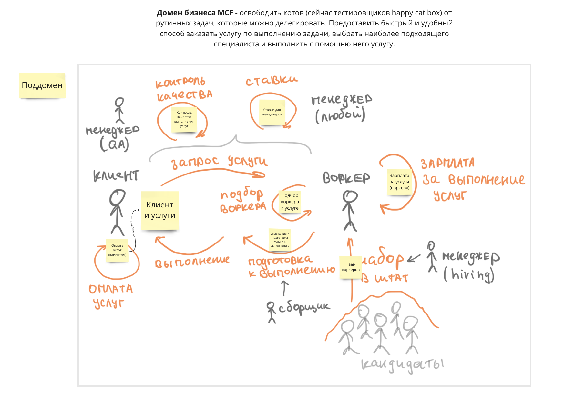
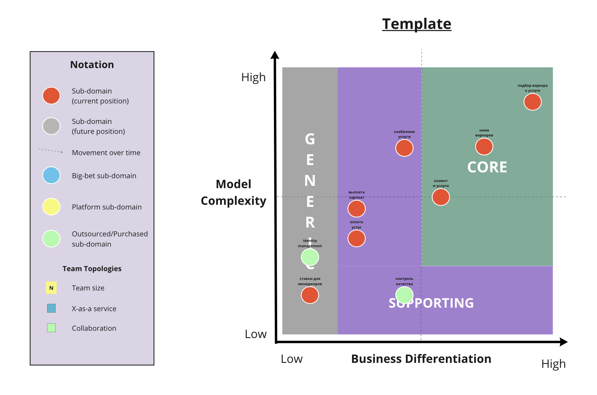
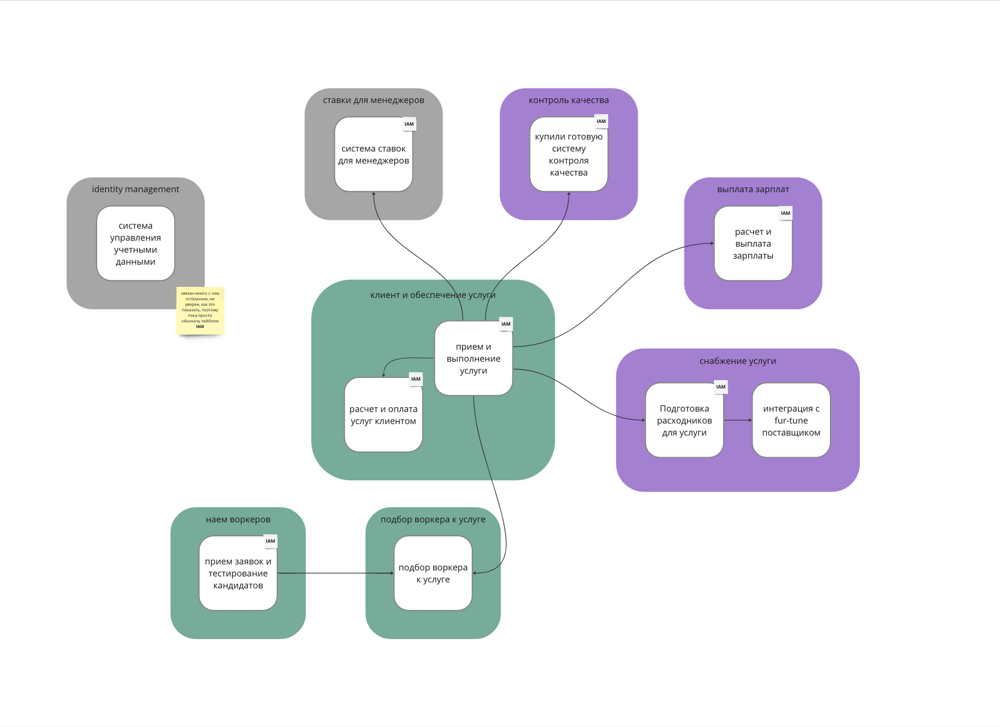
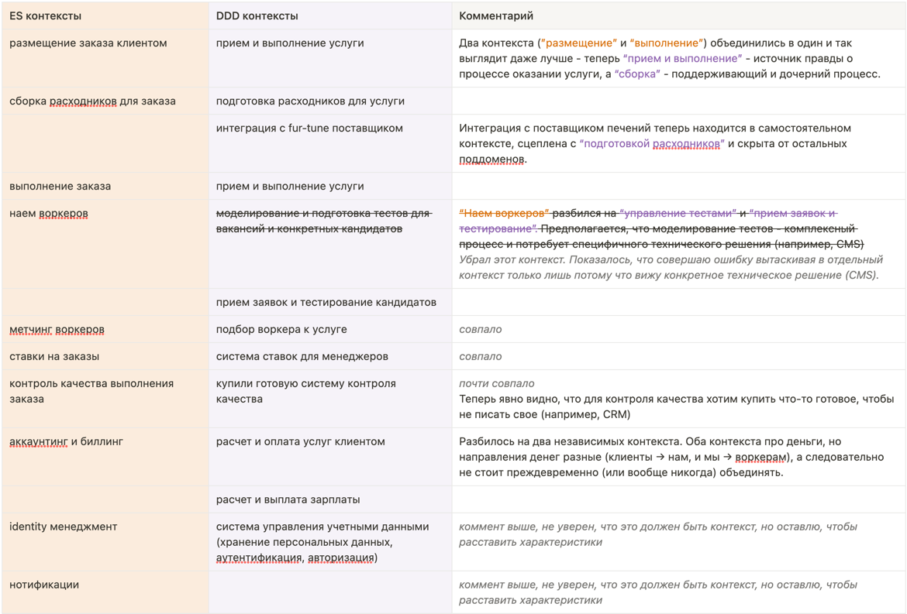
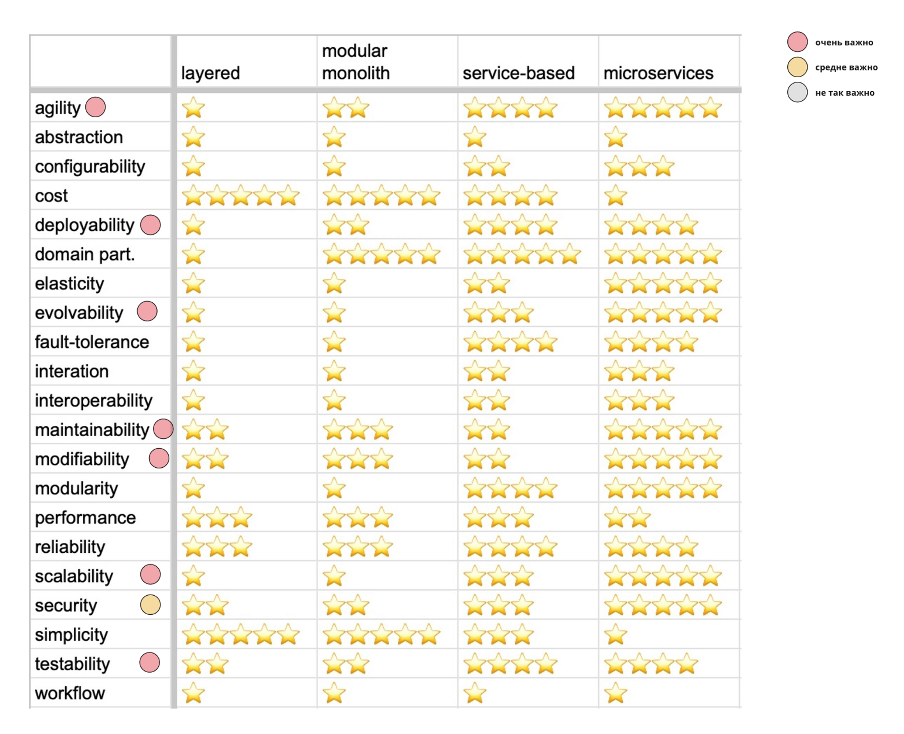
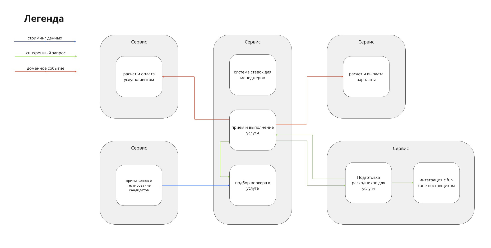

# Week 2: strategic DDD

# Domain and subdomains

**Домен бизнеса MCF -** освободить котов (сейчас тестировщиков happy cat box) от рутинных задач, которые можно
делегировать. Предоставить быстрый и удобный способ заказать услугу по выполнению задачи, выбрать наиболее подходящего
специалиста и выполнить с помощью него услугу.

Обнаружил следующие поддомены:

- клиент и обеспечение услуги
- подбор воркера к услуге
- снабжение услуги
- выплата зарплат
- наем воркеров
- контроль качества
- ставки для менеджеров

## Core поддомены

Обнаружил три Core поддомена:

- “клиент и обеспечение услуги”
- “подбор воркера к услуге”
- “наем воркеров”.

У всех них высокий показатель business diff, т.к. это ключевые проблемы, которые решает наш бизнес - нанять подходящих
воркеров, принять услугу от клиента и найти для услуги лучшего воркера. У всех них не низкий model compl, т.к.
характеристики воркеров и клиентов это весьма специфичные показатели. Поэтому эти три поддомена попадают в Core.

### **“подбор воркера к услуге”**

Максимальная business diff и model compl, т.к. содержит “уникальную систему метчинга [US-060]”.

### **“наем воркеров”**

Model compl выше, чем у “клиент и обеспечение услуги”, потому что проблема поддомена весьма сложная - подобрать воркера,
который “входит в 3% лучших котов мира. [US-080]”. business diff тоже выше, чем у “клиент и обеспечение услуги”, т.к. на
старте фокус бизнеса будет смещен к поиску и корректной оценке самых (топ 3%) элитных воркеров *(это предположение
необходимо верифицировать с бизнесом)*.

### **“клиент и** обеспечение **услуги”**

Минимальная model compl и business diff среди Core поддоменов. Коты-тестировщики happy cat box очень уставшие и вначале
им требуется хоть какое-нибудь решение их проблем, главное чтобы качественно и в срок. Поэтому качество процессов,
связанных с клиентом (регистрация, создание услуги, выполнение услуги с точки зрения информационной систем и т.д.) не
так приоритетно, как подбор лучшего воркера к требуемой услуге. К тому же, характеристики клиента и его услуги куда
более просты по сравнению с характеристиками воркеров *(эти предположения необходимо верифицировать с бизнесом).*

> В какой-то момент возникла мысль поместить “клиент и обеспечение услуги” в supporting, т.к. в нем не было видно
> “уникальности” для бизнеса - поддомен выглядел достаточно простым, т.к. необходимо всего лишь принять запрос на услугу
> от клиента. Однако позже пришла мысль, что успешность подбора воркеров зависит еще и от характеристик услуги, которую
> запрашивает клиент, поэтому оставил этот домен в Core.
>

## Supporting поддомены

Обнаружил 4 Supporting поддомена:

- “снабжение услуги”
- “выплата зарплат”
- “контроль качества”

  Business differentiation у всех доменов приблизительно одинаковый, т.к. это важные поддомены для решения главной
  проблемы бизнеса, однако не уникальные, как в Core.

### “снабжение услуги”

Самый сложный (высокий model compl) и один из самых уникальных (высокий business diff) среди всех supporting поддоменов,
т.к. формирует процесс выполнения услуги и влияет на качество выполнения услуги и удовлетворенность клиента.

### “выплата зарплат” и “оплата услуг”

Средне-сложные и самые неуникальные supporting поддомены. “Выплата зарплат” чуть сложнее, потому что там больше условий.
В выплате или получении денег ничего уникального кроме правил расчета для бизнеса нет.

### “контроль качества”

Самый несложный, но один из самых “уникальных” supporting поддоменов. Контроль качества это внутренний процесс, в
котором достаточно следить за жизненным циклом услуги и данных, которые к ней относятся. “Уникальность” и важность для
бизнеса у него высока, т.к. именно через контроль качества происходит оценка успешности метчинга, что является важным
для бизнеса на старте *(это предположение необходимо верифицировать с бизнесом).*

## Generic поддомены

Обнаружил 1 generic поддомен - “ставки для менеджеров”

Его уникальность и важность (business diff) для бизнеса видится крайне низкой, т.к. это внутренний процесс, направленный
на повышение эффективности менеджеров, которых в компании немного. Его “сложность” (model compl) так же видится низкой,
т.к. это хорошо известный механизм ставок.

# Bounded-контексты

Выделил следующие bounded-контексты

- поддомен “клиент и обеспечение услуги”
    - прием и выполнение услуг
    - расчет и оплата услуг клиентом
- поддомен “наем воркеров”
    - моделирование и подготовка тестов для вакансий и конкретных кандидатов
    - прием заявок и тестирование кандидатов
- поддомен “подбор воркера к услуге”
    - подбор воркера к услуге
- поддомен “снабжение услуги”
    - сборка заказа
    - интеграция с fur-tune поставщиком
- поддомен “выплата зарплат”
    - расчет и выплата зарплаты
- поддомен “контроль качества”
    - *купили готовую систему контроля качества*
- поддомен “ставки для менеджеров”
    - система ставок для менеджеров

## Расхождения с контекстами, найденными по ES

> 🤔 Пока сравнивал с ES, пришел к выводу, что “identity management” и “рассылка нотификаций” очень похожи на
> самостоятельные контексты, но не знаю, к какому поддомену их отнести и правильно ли выделять их в отдельные
> поддомены/контексты. С одной стороны, кажется, что да, т.к. их оценка и размещение на core domain chart и оценка
> характеристик имеют значение, с другой стороны - Ибрагим их не выделил.
> Решил выделить identity management в отдельный домен, т.к. вижу там целый кластер проблем: идентификация
> пользователей (
> всех: воркеров, клиентов, менеджеров), хранение персональных данных, управление правами и т.д.
> Нотификации на отдельный домен не тянут, а вот на отдельный контекст - вполне, но пока их добавлять не буду.

# Обновление ES и DM по результатам DDD

## Как изменились контексты

- Полностью убрал контекст нотификаций.
- Аккаунтинг и биллинг разбился на два новых контекста.
- Выделился контекст интеграции с fur-tune поставщиком.
- Смержился контекст размещение заказа и выполнение заказа.

## Где бизнес-команда разбиралась на технические шаги

- в выплате зарплат воркерам и списании средств у клиентов были лишние шаги “генерирования инвойса”, убрал их. Теперь
  завершился цикл → снимаем / выплачиваем деньги.
- при приеме заказа от клиента вижу, что шаги “назначить воркера на заказ” и “рассчитать стоимость заказа” выглядят
  слишком низкоуровневыми, чтобы быть на ES диаграмме. Однако “рассчитать стоимость заказа” хочу оставить для
  отображения связи с контекстом “подбор воркера к услуге”, а “рассчитать стоимость заказа” хочу оставить для явно связи
  с контекстом “расчет и оплата услуг клиентом”.

## Обновление DM модели по результатам DDD

Изменения в контекстах полностью соответствуют изменениям в ES модели.

Из плюсов отметил, что в общих чертах DM модель стала проще, стало меньше связей между контекстами. Из минусов - домен
“прием и выполнение услуги” выглядит “монструозным” из-за связей с другими контекстами.

# Характеристики и выбор архитектурного стиля

| Характеристика  | Важность для проекта                                                                                                                                                                                                                                                                                                                                                                                                                                                                                                                                                                                 |
|-----------------|------------------------------------------------------------------------------------------------------------------------------------------------------------------------------------------------------------------------------------------------------------------------------------------------------------------------------------------------------------------------------------------------------------------------------------------------------------------------------------------------------------------------------------------------------------------------------------------------------|
| Availability    | <b>Не так важно</b>                                                                                                                                                                                                                                                                                                                                                                                                                                                                                                                                                  |
| Scalability     | <b>Не так важно (в общем)</b>   <b>Очень важно (в конкретном поддомене)</b>  Ожидается низкая базовая нагрузка, информации о пиках нагрузки нет. Предполагаю, что раз это дочерняя компания (и множество клиентов ограничено), то скачков нагрузки не будет. НО эта характеристика важна у конкретного контекста “наем воркеров”, т.к. будет паблик и ожидается ddos.   [US-081] Мы ожидаем 1 к заявок в день от рандомных котов, также, судя по отзывам, наши конкуренты могут попытаться нас заддосить в этом месте. |
| Modifiability   | <b>Очень важно</b>   Метрика влияет напрямую на TTM.   ”Бизнесу необходим высокий низкий ТТМ (Time To Market), чтобы конкурировать на рынке.”                                                                                                                                                                                                                                                                                                                                                                                                               |
| Maintainability | <b>Не так важно</b>                                                                                                                                                                                                                                                                                                                                                                                                                                                                                                                                                  |
| Securability    | <b>Средне важно</b>   Система работает с персональными данными (ФИО, адреса, контактные данные) + содержит детали о услугах (может быть чувствительная информация)                                                                                                                                                                                                                                                                                                                                                                                            |
| Performance     | <b>Не так важно</b>   “Общая нагрузка на систему не будет превышать 10 заказов в день и 100 клиентов. Воркеров будет 20 человек.”                                                                                                                                                                                                                                                                                                                                                                                                                                                                  |
| Agility         | <b>Очень важно</b>   В некоторых частях системы у бизнеса есть опасения, поэтому необходимо быстро подстроиться к изменениям, если возникнут. Например:   ”[US-170] Хоть получение каждого печенья поштучно под клиента выглядит странно, мы всё равно решили воспользоваться этой компанией.”   ”[US-290] Это не самый критически важный проект для компании, поэтому он вряд ли будет часто меняться.”                                                                                                                                                                                 |
| Testability     | <b>Очень важно</b>   Как и Modifiability                                                                                                                                                                                                                                                                                                                                                                                                                                                                                                                                                           |
| Deployability   | <b>Очень важно</b>   Как и Modifiability                                                                                                                                                                                                                                                                                                                                                                                                                                                                                                                                                           |
| Usability       | <b>Не так важно</b>   Большая часть пользователей системы - клиенты, которые являются сотрудниками родительской компании, поэтому у них ожидается высокая лояльность и терпимость к системе.                                                                                                                                                                                                                                                                                                                                                                                                       |
| Consistency     | <b>Не так важно</b>   В системе нет критичных процессов, которые бы требовали очень высокую consistency                                                                                                                                                                                                                                                                                                                                                                                                                                                                                            |
| Simplicity      | <b>Не так важно</b>   Как и Usability                                                                                                                                                                                                                                                                                                                                                                                                                                                                                                                                                              |

Выбираем из следующих стилей:

- layered
- modular monolith
- service-based
- microservices

Сравнение архитектурных стилей по характеристикам указывает на то, что лучше всего подходит микросервисный подход.

С микросервисным подходом в данном случае я согласен и хотел бы выбрать его, но это не означает, что нужно сделать
микросервис per баундед-контекст. Т.к. бизнес находится в фазе роста, необходимо найди баланс, чтобы слишком не
перегрузить систему и людей проблемами микросервисного подхода: коммуникации между сервисами, observability, debugging и
т.д.

# Результат: архитектура

Выделил 5 сервисов:

**по сервису на зарплату и оплату услуг** - Отделил друг от друга, чтобы были независимые и были готовы к расхождению в логике обработки бизнес-событий.

**сервис для приема заявок** - отдельно, т.к. нужно уметь скейлить и выдерживать ddos.

**сервис для подготовки заказа и интеграции с fur-tune поставщиком** - объединил на первое время, чтобы не перегружать систему. Если начнет разрастаться - можно разделить, главное снимать
метрики и следить.

**“главный” сервис с полным жизненным циклом задачи, алгоритмом подбора воркера на задачу и системой ставок** - объединил на первое время, чтобы перегружать систему. Если начнет разрастаться - можно разделить, главное снимать
метрики и следить.

Разработчики алгоритма подбора обещали, что справятся с разработкой алгоритма на любом языке [US-070].

Система ставок не будет часто меняться [US-290] и сложной логики там нет.

Коммуникации:

- старался выбирать синхронные, чтобы было меньше технологического оверхеда. Как только синхронных коммуникаций
  перестанет хватать (напр. в логике метчинга воркера или в передаче заказа на сборку), то можно подумать о асинхронных.
- из “найма воркеров” в “подбор воркеров для задачи” выбрал стриминг, чтобы не блокировать процессы в найме добавление
  нового воркера в алгоритм.
- в сервисы с зарплатой и оплатой услуг выбрал асинхронную коммуникацию с помощью доменных событий, т.к. для расчета
  зарплаты/оплаты услуг важны доменные события, а не только конечные данные.