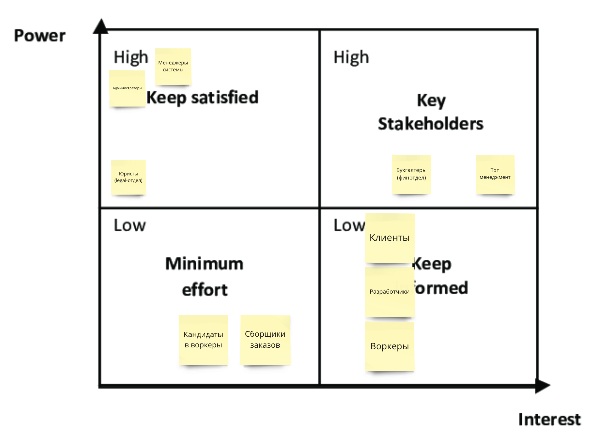

# Week 3: stakeholders, characteristics, conditions and limitations

# Поиск стейкхолдеров

> попробуйте расписать стейкхолдеров по группам из урока. Попутно пофантазируете, кого потенциально мы забыли указать в списке стейкхолдеров;
>

От себя добавил таких стейкхолдеров:

- кандидаты в воркеры
- воркеры
- сборщики заказов
- датасайнтисты / разработчики алгоритма метчинга

# Выбор архитектурного стиля (анализ контекстов)

> выберите один из семи архитектурных стилей, описанных в уроке. Опишите, почему вы сделали такой выбор и по каким критериям сравнивали стили (можно использовать картинку из урока со сравнением стилей);
>
> - если выбрали распределённый архитектурный стиль, опишите, какие сервисы будут отдельно, и объясните, почему каждый из сервисов должен быть отдельно от остальных;

# Найденные ограничения

## Цену инфраструктуры не учитываем

*“Инфраструктуру считаем бесплатной, прямо как в уроке, так как Happy Cat Box расскажет нам, как такое организовать”* - получили от бизнеса (дано в уроке)

**Вывод:** цену инфраструктуры не учитываем.

## Соблюдаем CatFinCompliance

*“Соблюдение CatFinComplience, который говорит об особом способе хранения данных и особой наблюдаемости за системой. Компания не хочет повторять опыт с маски-шоу, которые были в Happy Cat Box.”* - получили от бизнеса (дано в уроке)
Нужно обратить внимание на условия и решение, примененное в Happy Cat Box:

> регуляторы требуют от бухгалтеров хранить финансовую информацию на территории страны и без возможности её изменить после проведения;
>

# Характеристики из прошлой итерации (урока 2)

- **~~scalability~~** **availability** для контекста “прием заявок и тестирование кандидатов” (из US-081 DDoS)
- **agility, testability** и **deployability** - из-за низкого TTM, для всей системы
- **agility** для поддомена “подбор воркера к услуге”
- **modifiability** и **maintainability** - из high model complexity поддоменов “клиент и управление услугами”, “подбор воркера к услуге” и “расширение штата воркеров”

# Характеристики, найденные в текущей итерации

- высокая **scalability**, **maintainability**, **modifiability**, **testability**, **agility** и **evolvability** - для всей системы, т.к. система находится на стадии роста + от стейхолдеров известно, что будет в 10 раз больше заказов.
- высокая **securability** и **consistency** - для контекстов “выплат”, для соблюдения CatFinCompliance. (от юристов)
- высокая **modularity** и **evolvability** - для поддоменов “подбор воркера к услуге” и “расширение штата воркеров”, требование от топ-менеджмента
- **базовый релизный цикл** (для всей системы) - месяц
- **релизный цикл для поддомена “подбор воркера к услуге”** - максимум неделя
- **agility,** **modularity** и **testability** - для контекста “расчет и оплата услуг клиентом”, т.к. будут добавляться новые способы оплаты.
- **изолированный** поддомен “повышения мотивации менеджеров”
- **observability** - для всей системы, требование от администратором
- **availability** - от клиентов, для контекста “прием и выполнение услуги”
- **simplicity** - от разработчиков (посмотрим, нужно ли как-то явно выполнять или нет)

# Характеристики - итог

# Разделение на сервисы (подсистемы)

Берем наши контексты и принимаем решения:

1. "*поставка fur-tune печений клиенту” -* внешняя система, поэтому отдельно
2. “*готовая CRM для контроля качества и связи с клиентами / воркерами” -* внешняя система, поэтому отдельно
3. “система ставок для менеджеров” - отдельная подсистема, т.к. по требованиям стейкхолдеров необходимо его “спрятать” от всех остальных частей системы, разрабатывать, деплоить, мониторить отдельно.
4. “прием заявок и тестирование кандидатов” - отдельная подсистема, т.к. ему необходимо обеспечить высокую availability (user-facing + ddos)
5. “система метчинга воркера на услугу” - отдельная подсистема, т.к. ему необходимо обеспечить ускоренный релизный цикл.
6. “расчет и выплата зарплаты” - отдельная подсистема, чтобы выполнять требования каплаенса, безопасности и legal по хранению и обработке данных.
7. “расчет и оплата услуг клиентом” - отдельная подсистема, т.к. будет расширяться методами оплаты (тут не уверен, стоит ли выносить в отдельный, возможно, это лишнее и можно по-началу смержить с “зарплатным” сервисом, т.к. характеристики не конфликтуют)
8. “прием и выполнение услуг” и “подготовка расходинков для услуги” - мержу в одну подсистему, т.к. характеристики не конфликтуют, не хочется делать лишнюю подсистему, чтобы снизить операционную нагрузку на систему.

# Выбор архитектурного стиля и вида базы данных для каждого сервиса (подсистемы)

Итого, после предыдущего шага получилось 6 подсистем, т.е.:

- 5 одноименных подсистем, содержащих один контекст
- 1 подсистема “исполнения услуг”, который содержит контекст “прием и выполнение услуги” и “подготовка расходников для услуги”

**Подсистема** “**исполнения услуг” - modular monolith,** потому что содержит два контекста, которые мы хотим доменно отделить друг от друга (для большего порядка внутри подсистемы, для параллелизации работы над подсистемой, для готовности разделить в разные сервисы если понадобится)

**Подсистема “метчинга воркера на услугу”** **-** **pipeline**, чтобы обеспечить высокую flexibility, modularity и modifiability, которую хочет как бизнес, так и разработчики.

**Подсистема “ставки для менеджеров” - layerd monolith**, выбираем самый простой и привычных стиль, т.к. не содержит сложной логики и критической для бизнеса функциональности.

**Подсистема “прием заявок и тестирование кандидатов” - microkernel**, т.к. должна иметь высокую modifiability, modularity, evolvability для быстрого реагирования на изменения бизнеса (например, в случаях, когда результаты проверки гипотез приведут к новым фичам для этого контекста).

**Подсистемы “расчет и оплата услуг клиентом” и “расчет и выплата зарплаты” - layered monolith**, несмотря на то, что бизнес-логика сложна, выбираем простой и привычный стиль, чтобы не усложнять эти подсистемы (simplicity).

**Документоориентированная база данных** будет использоваться в двух подсистах

- прием заявок и тестирование кандидатов
- система метчинга воркера на услугу

Будет один физический инстанс с логическим разделением на две разные базы данных для снижения операционных расходов в системе.

В этих подсистемах не критичная консистентность, однако критичная flexibility и modifiability данных (для частых изменений в подсистемах)

**Реляционная база данных** будет использоваться в остальных подсистемах.

Для подсистем “выплат зарплат” и “оплаты услуг” географические расположение данных и соблюдение комплаенса, это будет отдельный инстанс базы данных.

Для подсистемы “исполнения услуги” выбираем тот же типа базы данных для технологической консистентности и упрощения одной из самых крупных подсистем.

Для подсистемы “ставок” выбираем тот же типа базы данных по тем же причинам + это будет отдельный инстанс, чтобы “спрятать” его от остальных в компании (требование стейкхолдеров)

# Выбрать нужный стиль коммуникаций и их вид в системе

В местах, где задержка в актуализации данных не так критична, однако данные нужно поддерживать в актуальном состоянии выбирал **асинхронную коммуникацию через репликационные события** (напр. стриминг из “исполнения услуг” в “выплаты зарплаты” и “оплату услуг”)

В местах, где не так много логики и достаточно on demand получить небольшое количество данных, выбирал **синхронную коммуникацию**. (напр. расчет скидки, получение воркера к услуге, запрос печенья при сборке)

В местах, где бизнес-логика зависит от событий и в то же время нет необходимости немедленного получения результата выбирал **асинхронную коммуникацию с помощью отправки бизнес-событий**, чтобы не блокировать процесс-emitter событий. (напр. получение доменных событий в сервисах “выплаты зарплат” и “оплаты услуг”, в сервисах “ставок” и “контроля качества”)

При выборе между асинхронной доменной коммуникацией и синхронной преимущество имела синхронная для простоты системы и низкого порога вхождения имплементаторов.

# Верификация и фитнес-функции

- покрытие тестами
  - core-поддомены 90%
  - остальные поддомены 60%
- проверка соблюдения необходимой периодичности релизов
  - “система метчинга воркера на услугу” - максимум 1 неделья
  - остальные подсистемы - максимум 4 недели
- репорты о выданных доступах в БД
  - критично для подсистем “выплата зарплат” и “оплата услуг”
- ручной контроль соблюдения архитектурных стилей
  - модульный монолит для подсистемы “прием и выполнение услуги”
  - микрокернел для подсистемы “приема заявок и тестирования кандидатов”
  - пайплайн для подсистемы “метчинга воркера на услугу”
  - *в будущем возможна имплементация с помощью ArchUnit, т.к. система будет написана на Java стеке (язык Kotlin), но на старте проекта на это не стоит тратить время*
- ручной контроль доступов к подсистеме “ставок” (код, документация, окружение и т.д.)
- ручное отслеживание достаточно высокого уровня observability всей системы
  - сбор необходимой базовой телеметрии со всех компонент
- автоматический контроль availability с помощью мониторинга значения и алертинга в случае нарушений
  - у подсистемы “прием заявок и тестирование кандидатов” - на старте достаточно 99%
  - у подсистемы “прием и выполнение услуги” - 99.9%
- автоматический контроль scalability с помощью нагрузочных тестов в пайплайне
  - у подсистемы “прием заявок и тестирование кандидатов” - на старте достаточно 99%
  - у подсистемы “прием и выполнение услуги” - 99.9%
- автоматический контроль reliability у поддомена “прием заявок и тестирование кандидатов” с помощью эмуляции ddos атаки на live окружении
- анализ метрик coupling и cohesion вручную методом исследования кода и автогенерируемой документации
  - подсистема “прием заявок и тестирование кандидатов”
  - подсистема “система метчинга воркера на услугу”
  - подсистема “прием и выполнение услуги”

# Написать ADR

## ADR-00X: Изоляция контекста “прием заявок и тестирование кандидатов” в отдельный сервис

### ****Status****

*Accepted*

### ****Context****

Необходимо принять решение, в каком виде будет реализован контекст “прием заявок и тестирование кандидатов” в системе:

- будет самостоятельным сервисом
- будет объединен в один сервис с другим контекстом, имеющим схожие характеристики - “прием и выполнение услуги”

### ****Decision: Будет самостоятельным сервисом****

Решено иметь контекст “прием заявок и тестирование кандидатов” изолированно в отдельном сервисе, так как:

- помимо высокой availability у сервиса есть риск быть подвергнутым DDoS атакам, потому что сервис доступен в интернете.

Для обеспечения высокого значения resilience (отказоустойчивости) всей системы и чтобы не перемешивать контексты из разных поддоменов решено не объединять с контекстом “прием и выполнение услуги”, а сделать самостоятельным сервисом.

### **Consequences**

В результате этого решение вырастает нагрузка на поддержку и обеспечение всей системы, однако это намного меньшее зло, чем подвергнуть риску выводу из строя сразу обе подсистемы / контекста.

### **Сompliance**

К сожалению, может быть проверено только вручную архитектурным ревью системы.

### **Alternatives**

- контекст будет объединен в один сервис с другим контекстом, имеющим схожие характеристики - “прием и выполнение услуги”